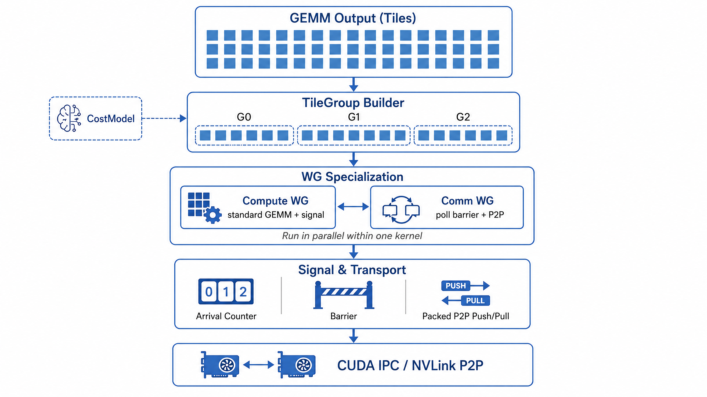
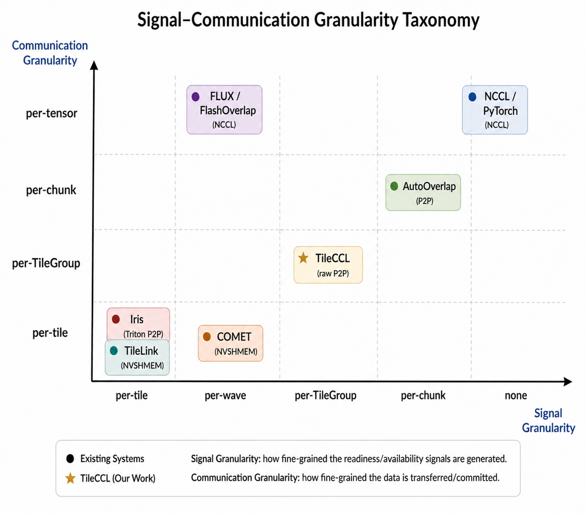

<div align="center">

<p>
  
</p>

# TileCCL: Tile-Native Collective Communication Library

<div align="center">
  <table>
    <tr>
      <td align="center" width="50%">
        <br/>
        <strong>Institute of Information Engineering</strong><br/>
        Chinese Academy of Sciences<br/>
        <em>State Key Laboratory of Cyberspace Security Defense</em>
      </td>
      <td align="center" width="50%">
        <br/>
        <strong>Institute of Microelectronics</strong><br/>
        Chinese Academy of Sciences<br/>
        <em>Artificial Intelligence Chip and System Research and Development Center</em>
      </td>
    </tr>
  </table>
</div>

[](LICENSE)
[]()
[]()
[]()

</div>

## Overview

TileCCL is a **tile-native collective communication library**. It inserts a
**TileGroup** abstraction between individual GEMM tiles and full collective
tensors, so that communication granularity is determined by physical constraints
rather than API boundaries.

- **Does not modify the GEMM kernel.** Adds one `atomic_add` in the epilogue.
- **TileGroup = physics-driven grouping.** P0 (P2P saturation) + P1 (wave
  alignment) + P2 (pipeline balance) determine group boundaries.
- **Device-side P2P.** Compute workgroups and communication workgroups run
  concurrently in a single persistent kernel. Ready TileGroups are pushed to
  peer GPUs immediately via CUDA IPC, without NCCL or NVSHMEM.
- **Proven on two collectives.** GEMM-output AllGather (1.40–1.53×) and
  GEMM→ReduceScatter (1.43–1.68×) on 2×H100 with same-backend controlled
  experiments.

## Architecture

<p align="center">
  
</p>

GEMM produces tiles. The **TileGroup Builder** (driven by a CostModel) groups
them into physically-sized units. Compute and communication workgroups then run
concurrently in a single persistent kernel — compute produces and signals,
communication polls barriers and pushes ready groups to peers via CUDA IPC.

## Data Flow

<p align="center">
  
</p>

Three granularities compared: **bulk tensor** (one large transfer), **per-tile**
(many tiny transfers), and **TileGroup** (tiles assembled into groups, then one
transfer per group). TileGroup balances signal overhead against P2P efficiency.

## Signal-Communication Granularity

<p align="center">
  
</p>

Existing systems occupy different points in the signal-vs-communication
granularity space. TileCCL sits on the diagonal — signal and communication
aligned at the same TileGroup granularity, determined by physical constraints
rather than hardcoded or compiler-fixed.

## Preliminary Results

These are early proof results on 2x NVIDIA H100 PCIe GPUs with NVLink peer
access. The fused proofs use the same Triton persistent GEMM backend across all
variants; differences are limited to TileGroup signaling and device-side P2P
communication.

### Gate 1: GEMM-output AllGather

| Shape MxNxK | S0 Bulk | S1 per-tile signal | S2 TileCCL | Speedup | Signal overhead |
|:---|---:|---:|---:|---:|---:|
| 16384x4096x1024 | 1.211 ms | 1.217 ms | 0.792 ms | 1.53x | +0.6% |
| 8192x4096x2048 | 0.887 ms | 0.895 ms | 0.632 ms | 1.40x | +0.8% |
| 8192x4096x1024 | 0.693 ms | 0.698 ms | 0.455 ms | 1.52x | +0.7% |

### Gate 2: GEMM to ReduceScatter

| Shape MxNxK_total | S0 Bulk | S1 per-tile signal | S2 TileCCL | Speedup | Signal overhead |
|:---|---:|---:|---:|---:|---:|
| 16384x4096x2048 | 1.618 ms | 1.630 ms | 0.961 ms | 1.68x | +0.7% |
| 8192x4096x4096 | 1.105 ms | 1.113 ms | 0.771 ms | 1.43x | +0.7% |
| 8192x4096x2048 | 0.905 ms | 0.921 ms | 0.585 ms | 1.55x | +1.7% |

## Repository Layout

```text
TileCCL/
├── tileccl_v2/              # Framework seed
│   ├── heap.py              # CUDA IPC symmetric heap
│   ├── ipc.py               # Pointer translation, signal/wait, P2P primitives
│   ├── tile_group.py        # TileGroup planning (P0+P1+P2 constraints)
│   ├── wg.py                # Compute/comm WG allocation
│   ├── collective_spec.py   # AG/RS semantics
│   ├── signal.py            # TileGroup signal tensor layout
│   ├── transport.py         # P2P transport plan (push/pull, packed copy)
│   ├── cost_model.py        # Cost model seed
│   └── runtime/timeline.py  # Timeline artifact recorder
├── assets/                  # Architecture & dataflow diagrams
└── images/logo/             # Institution logos
```

The proof experiments (`fused_ag_iris.py`, `fused_rs_iris.py`) live in a
separate experimental repository and are not part of this framework seed.

## Installation

TileCCL requires Python 3.10+, PyTorch 2.4+, and Triton 3.0+.

```bash
pip install -e .
```

For development utilities:

```bash
pip install -e ".[dev,benchmark]"
```

## Quick Start

```python
from tileccl_v2 import SymmetricHeap, build_tile_group_plan, build_p2p_transport_plan

spec = reduce_scatter_spec(world_size=2)
plan = build_tile_group_plan(8192, 4096, 128*128*2)
transport = build_p2p_transport_plan(comm_mode="push", copy_elems=16384)
print(plan.n_groups, transport.push_mode)
```

## Contributing

See [CONTRIBUTING.md](CONTRIBUTING.md).

## License

[Apache 2.0](LICENSE)
