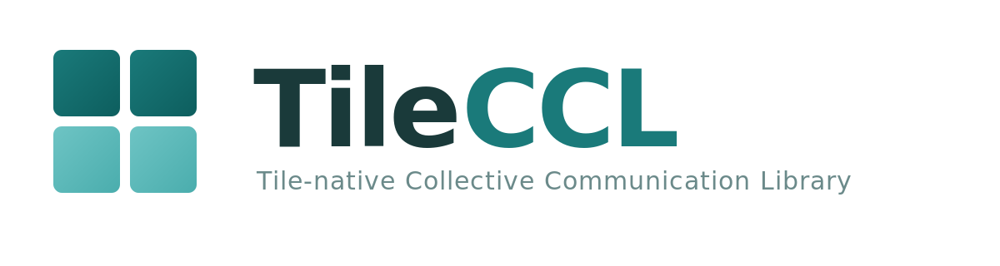

<p align="center">
  
</p>

# TileCCL: Tile-native Collective Communication Library

TileCCL brings collective communication into the tile programming model as a first-class library surface. Instead of hiding communication behind opaque runtime calls between kernels, TileCCL expresses allreduce, allgather, reduce-scatter, and fused GEMM+collective flows as compiler-visible Triton programs where compute, communication, and synchronization operate at the same tile granularity within a single device-side program.

<p align="center">
  
</p>

## Key Features

- **Three primitive groups, one compiler view.** Data movement (`tile_put`, `tile_get`, `tile_remote_store`), synchronization (`tile_signal`, `tile_wait`, remote atomics), and collectives (`tile_allreduce`, `tile_allgather`, `tile_reduce_scatter`) — all `@triton.jit` functions the Triton compiler can see and optimize end-to-end.

- **symmetric memory.** A 5-instruction `translate_ptr` maps any local heap offset to a peer GPU's address space. No staging buffers, no memcpy, no host round-trips — kernels directly read and write remote memory over NVLink or xGMI.

- **Tile-granularity overlap.** Communication begins the moment a tile is produced, not after the entire matrix is computed. Within a single persistent kernel, compute and communication interleave at tile boundaries, hiding latency behind useful work.

- **No opaque runtime.** Ring allreduce, direct-write allgather, atomic reduce-scatter — all implemented as pure Triton programs. The compiler optimizes the full compute-communication graph as a single program.

- **Cross-vendor from single source.** The same Triton primitive code compiles for NVIDIA (CUDA / NVLink) and AMD (HIP / xGMI). Backend abstraction handles IPC, topology detection, and peer access without changing the kernel source.

- **Plan-based execution.** Build an execution plan once (`build_gemm_allscatter_plan`), then reuse it across iterations. Planning overhead — pattern selection, contract validation, workspace allocation — is amortized to near zero.

## TileCCL Tile Primitive Groups

**Data Movement** — Two modes of cross-GPU tile transfer:
- *Value-based* (`tile_remote_load`, `tile_remote_store`): register-to-remote, fine-grained, ideal for small tiles.
- *Pointer-based* (`tile_put`, `tile_get`): memory-to-remote, RDMA-style, bulk throughput.

**Synchronization** — Tile-level coordination with explicit memory ordering:
- Producer-consumer: `tile_signal` / `tile_wait` (acquire-release semantics).
- Remote atomics: `tile_atomic_add`, `cas`, `xchg`, `min`, `max`, `and`, `or`, `xor` — all with configurable scope (`gpu` / `sys`).

**Tile Collectives** — Standard collective algorithms as pure Triton JIT code:
- `tile_allreduce`, `tile_allgather`, `tile_reduce_scatter`, `tile_broadcast`, `tile_scatter`.
- Implemented as ring protocols — fully visible to the compiler, no NCCL dependency.

## Quick Start

```bash
pip install -e ".[dev]"
```

```python
import torch
import tncc

ctxs = tncc.init_local(world_size=2, heap_size=512 * 1024 * 1024)
ctx = ctxs[0]

A = ctx.randn(4096, 4096, dtype=torch.float16)
B = ctx.randn(4096, 8192, dtype=torch.float16)
C = ctx.zeros(4096, 8192, dtype=torch.float16)

tncc.ops.gemm_allscatter(A, B, C, ctx=ctx)
```

See [`examples/`](examples/) for single-process, multi-process, and pattern benchmarking scripts.

## Supported Operations

| Operation | Contract |
|-----------|----------|
| `gemm_allscatter` | full/full, shard/shard, full/shard |
| `gemm_allgather` | shard/full |
| `gemm_reducescatter` | full/shard |
| `allgather` | &mdash; |
| `allreduce` | in-place |
| `reduce_scatter` | &mdash; |

## Compute-Communication Overlap Patterns

TileCCL implements four overlap strategies, inspired by [Iris](https://github.com/ROCm/iris) (AMD Research). Each trades off complexity for overlap opportunity, from a bulk-synchronous baseline to SM-partitioned workgroup specialization.

Auto-selection chooses the best pattern based on problem shape and hardware:

```python
pattern = ctx.auto_select_pattern("gemm_allscatter", M=M, N=N, K=K)
```

## Development

```bash
make install-dev   # Install with dev + benchmark dependencies
make test          # Run tests
make lint          # Ruff linter
make bench         # Run benchmarks
```

CLI benchmarking:

```bash
tncc bench pattern --quick    # Compare overlap patterns
tncc bench gemm               # GEMM kernel performance
tncc bench p2p                # P2P bandwidth sweep
tncc bench all                # Run all benchmarks
```

## Requirements

- NVIDIA GPUs with NVLink interconnect (verified on H100), or AMD GPUs with xGMI
- CUDA 12.x / ROCm 6.x, PyTorch >= 2.4, Triton >= 3.0

## Contributing

See [CONTRIBUTING.md](CONTRIBUTING.md).

## License

[Apache 2.0](LICENSE)
