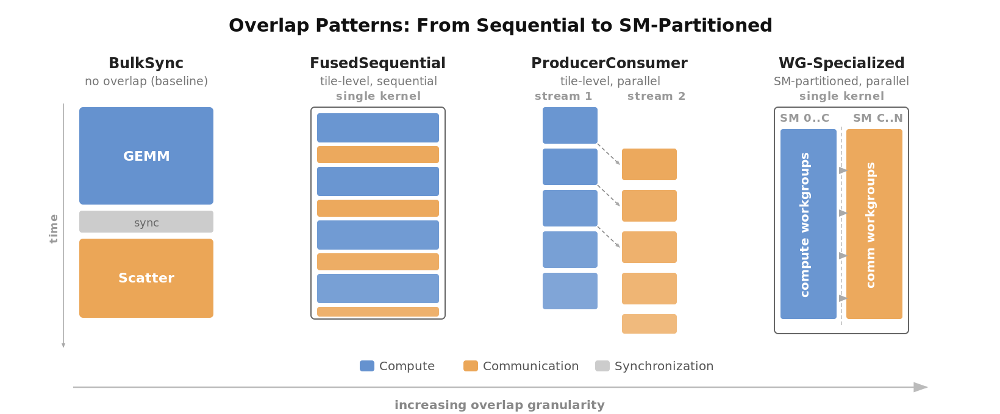

# TNCC: Tile-Native Collective Communication

TNCC brings collective communication into the tile programming model. Instead of treating communication as opaque runtime calls between kernels, TNCC expresses allgather, reduce-scatter, allreduce, and GEMM+collective patterns as compiler-visible Triton programs, where compute and communication operate at the same tile granularity within a single device-side program.

Inspired by [Iris](https://github.com/ROCm/iris) (AMD Research).

<p align="center">
  
</p>

## Key Ideas

- **Communication as a tile primitive.** Compute, memory, and communication are co-equal building blocks in the same `@triton.jit` program. The compiler sees everything.
- **Overlap at tile granularity.** Communication can begin as soon as a tile is produced, not after the entire matrix is computed.
- **Four overlap patterns.** From bulk-synchronous baseline to SM-partitioned workgroup specialization, each a concrete executable strategy.
- **Plan-based execution.** Host-side validation is separated from device-side execution. Plans are built once and reused.

## Overlap Patterns

TNCC implements four compute-communication overlap strategies. Each trades off implementation complexity for overlap opportunity.

<p align="center">
  
</p>

| Pattern | Mechanism | Overlap |
|---------|-----------|---------|
| **BulkSync** | GEMM, barrier, then scatter | None (baseline) |
| **FusedSequential** | Single persistent kernel; compute tile then scatter tile | Tile-level, sequential |
| **ProducerConsumer** | Dual-stream; compute and scatter in parallel | Tile-level, parallel |
| **WG-Specialized** | Single kernel; SMs partitioned into compute and comm workgroups | SM-level, parallel |

Auto-selection chooses the best pattern based on problem shape and hardware:

```python
pattern = ctx.auto_select_pattern("gemm_allscatter", M=M, N=N, K=K)
```

## Quick Start

```bash
pip install -e ".[dev]"
```

```python
import torch
import tncc

ctxs = tncc.init_local(world_size=2, heap_size=512 * 1024 * 1024)
ctx = ctxs[0]

A = ctx.randn(4096, 4096, dtype=torch.float16)
B = ctx.randn(4096, 8192, dtype=torch.float16)
C = ctx.zeros(4096, 8192, dtype=torch.float16)

tncc.ops.gemm_allscatter(A, B, C, ctx=ctx)
```

See [`examples/`](examples/) for single-process, multi-process, and pattern benchmarking scripts.

## Supported Operations

| Operation | Contract |
|-----------|----------|
| `gemm_allscatter` | full/full, shard/shard, full/shard |
| `gemm_allgather` | shard/full |
| `gemm_reducescatter` | full/shard |
| `allgather` | &mdash; |
| `allreduce` | in-place |
| `reduce_scatter` | &mdash; |

## Development

```bash
make install-dev   # Install with dev + benchmark dependencies
make test          # Run tests
make lint          # Ruff linter
make bench         # Run benchmarks
```

CLI benchmarking:

```bash
tncc bench pattern --quick    # Compare overlap patterns
tncc bench gemm               # GEMM kernel performance
tncc bench p2p                # P2P bandwidth sweep
tncc bench all                # Run all benchmarks
```

## Requirements

- NVIDIA GPUs with NVLink interconnect (verified on H100 PCIe)
- CUDA 12.x, PyTorch >= 2.4, Triton >= 3.0

## Contributing

See [CONTRIBUTING.md](CONTRIBUTING.md).

## License

[Apache 2.0](LICENSE)
