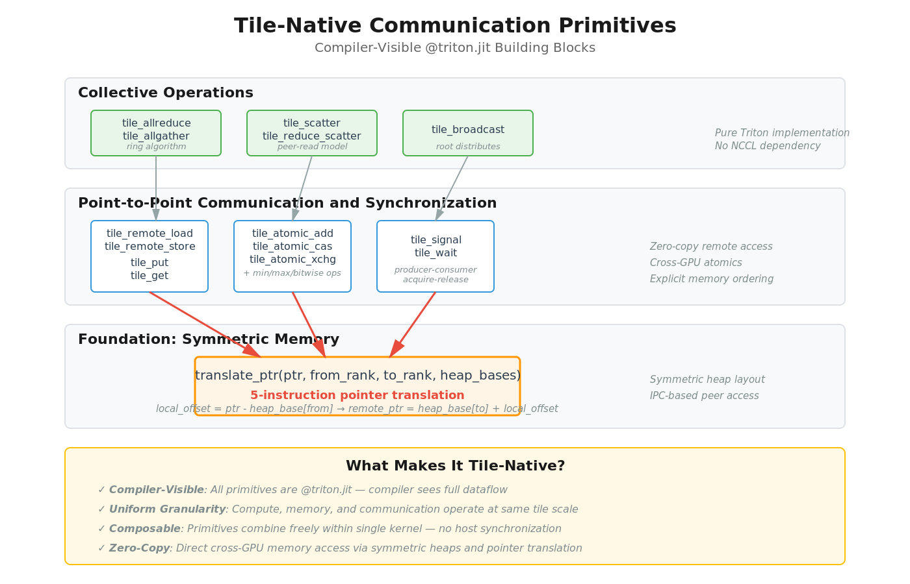

<p align="center">
  
</p>

# TNCC: Tile-Native Collective Communication

TNCC makes collective communication a first-class tile primitive in Triton. Communication operations are expressed as `@triton.jit` functions with the same granularity as compute and memory operations, giving the compiler full visibility into the entire compute-communication pipeline.

Inspired by [Iris](https://github.com/ROCm/iris) (AMD Research).

<p align="center">
  
</p>

## What Makes It Tile-Native?

**Compiler-Visible Primitives.** All communication operations are `@triton.jit` functions. The compiler sees compute, memory, and communication as equal building blocks within a single kernel.

**Uniform Granularity.** Operations work at tile scale — a 128×128 GEMM tile, a 128×128 communication tile, a 128×128 memory tile. This enables fine-grained overlap without host synchronization.

**Zero-Copy Translation.** Cross-GPU memory access via symmetric heaps and 5-instruction pointer translation. No data marshaling, no implicit barriers.

**Composable by Design.** Primitives combine freely within kernels. Build custom collective algorithms or compute-communication overlap patterns using the same tile operations.

## Tile Primitives

<p align="center">
  
</p>

TNCC provides three layers of tile primitives, all implemented as `@triton.jit` functions:

**Foundation: Symmetric Memory**
```python
translate_ptr(ptr, from_rank, to_rank, heap_bases)  # 5-instruction pointer translation
```

**Point-to-Point Communication**
```python
tile_remote_load / tile_remote_store  # Value-based cross-GPU access
tile_put / tile_get                    # Pointer-based bulk transfers
```

**Synchronization**
```python
tile_signal / tile_wait                # Producer-consumer coordination
tile_atomic_add / tile_atomic_cas      # Cross-GPU atomics with memory ordering
```

**Collective Operations**
```python
tile_allreduce / tile_allgather        # Ring algorithms, pure Triton
tile_scatter / tile_reduce_scatter     # No NCCL dependency
```

These primitives compose within kernels to build custom communication patterns.

## High-Level Operations

```python
import tncc

# Initialize symmetric heaps across GPUs
ctxs = tncc.init_local(world_size=2, heap_size=512 * 1024 * 1024)
ctx = ctxs[0]

# Allocate tensors in symmetric memory
A = ctx.randn(4096, 4096, dtype=torch.float16)
B = ctx.randn(4096, 8192, dtype=torch.float16)
C = ctx.zeros(4096, 8192, dtype=torch.float16)

# GEMM + collective communication in one call
tncc.ops.gemm_allscatter(A, B, C, ctx=ctx)
```

Supported operations: `gemm_allscatter`, `gemm_allgather`, `gemm_reducescatter`, `allgather`, `allreduce`, `reduce_scatter`.

## Installation

```bash
pip install -e ".[dev]"
```

See [`examples/`](examples/) for single-process, multi-process, and benchmarking scripts.

## Requirements

- NVIDIA GPUs with NVLink interconnect (verified on H100 PCIe)
- CUDA 12.x, PyTorch >= 2.4, Triton >= 3.0

## Contributing

See [CONTRIBUTING.md](CONTRIBUTING.md).

## License

[Apache 2.0](LICENSE)
