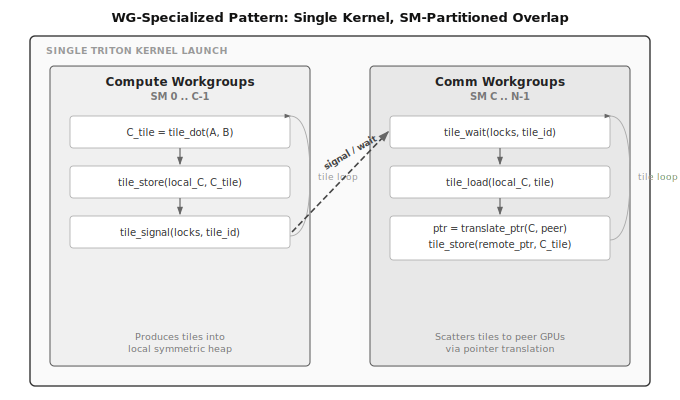

# TNCC &mdash; Tile-Native Compute-Communication Overlap

**Experimental framework for fusing collective communication with tiled computation on multi-GPU systems, built entirely in [Triton](https://github.com/triton-lang/triton).**

TNCC treats communication as a first-class device-side primitive &mdash; not an opaque runtime call between kernels. It expresses allgather, reduce-scatter, allreduce, and GEMM+collective patterns as compiler-visible Triton programs, enabling tile-granularity compute-communication overlap within a single device-side program.

Inspired by [Iris](https://github.com/ROCm/iris) (AMD Research).

> **Status:** Pre-alpha. Validated on 2&times; NVIDIA H100 (NVLink). Not a production-ready communication library.

---

## Architecture

<p align="center">
  
</p>

TNCC is organized as a layered stack:

- **User API** (`tncc.ops`) &mdash; high-level fused operations with explicit execution contracts
- **Plan Builder** &mdash; separates host-side validation from device-side execution; plans are reusable
- **Overlap Patterns** &mdash; four strategies for compute-communication overlap (see below)
- **Tile Primitives** &mdash; compute, memory, and communication as co-equal `@triton.jit` building blocks
- **Synchronization** &mdash; acquire/release signal-wait primitives and remote atomics
- **Symmetric Memory** &mdash; cross-GPU addressable heap with pointer translation
- **HAL** &mdash; hardware abstraction over CUDA and HIP backends

## Overlap Patterns

TNCC implements four compute-communication overlap strategies. Each is a concrete, runnable execution mode &mdash; not an abstract interface.

| Pattern | Mechanism | Overlap Granularity |
|---------|-----------|-------------------|
| **BulkSync** | GEMM &rarr; barrier &rarr; scatter | None (baseline) |
| **FusedSequential** | Single persistent kernel; compute tile then scatter tile | Tile-level, sequential |
| **ProducerConsumer** | Dual-stream; one computes, one scatters | Tile-level, parallel |
| **WG-Specialized** | Single kernel; SMs partitioned into compute and comm workgroups | SM-level, parallel |

<p align="center">
  
</p>

Auto-selection chooses among these based on problem shape and hardware topology:

```python
pattern = ctx.auto_select_pattern("gemm_allscatter", M=M, N=N, K=K)
```

## Supported Operations

| Operation | Contract | Status |
|-----------|----------|--------|
| `gemm_allscatter` | full/full | Supported |
| `gemm_allscatter` | shard/shard | Supported (via `gemm_allscatter_sharded`) |
| `gemm_allscatter` | full/shard | Supported |
| `gemm_allgather` | shard/full | Supported |
| `gemm_reducescatter` | full/shard | Supported |
| `allgather` | &mdash; | Supported |
| `allreduce` | in-place | Supported |
| `reduce_scatter` | &mdash; | Supported |

**Validated surface:** `world_size=2`, single-process peer-access and multi-process `ctypes_ipc` transport over NVLink.

## Quick Start

### Installation

```bash
pip install -e ".[dev]"
```

### Single-Process Multi-GPU

```python
import torch
import tncc

# Initialize with 2 GPUs in a single process
ctxs = tncc.init_local(world_size=2, heap_size=512 * 1024 * 1024)
ctx = ctxs[0]

M, K, N = 4096, 4096, 8192
A = ctx.randn(M, K, dtype=torch.float16)
B = ctx.randn(K, N, dtype=torch.float16)
C = ctx.zeros(M, N, dtype=torch.float16)

# Fused GEMM + all-scatter with automatic pattern selection
tncc.ops.gemm_allscatter(A, B, C, ctx=ctx)
```

### Multi-Process (torchrun)

```python
import torch
import tncc

# Each process initializes its own rank
ctx = tncc.init(backend="auto", heap_size=1 << 30)

A = ctx.randn(4096, 4096, dtype=torch.float16)
B = ctx.randn(4096, 8192, dtype=torch.float16)
C = ctx.zeros(4096, 8192, dtype=torch.float16)

tncc.ops.gemm_allscatter(A, B, C, ctx=ctx)
```

```bash
torchrun --nproc_per_node=2 your_script.py
```

### Reusable Execution Plans

```python
from tncc.ops import build_gemm_allscatter_plan

# Build once (host-side validation + pattern selection)
plan = build_gemm_allscatter_plan(A, B, C, ctx=ctx)

# Execute many times (device-side only)
for _ in range(100):
    plan.execute(A, B, C)
```

## Hardware Requirements

- 2&times; NVIDIA GPUs with NVLink interconnect
- Verified on: H100 80GB PCIe (NV12 bridge)
- CUDA 12.x, PyTorch &ge; 2.4, Triton &ge; 3.0

AMD HIP backend exists but is not validated on current hardware.

## Benchmarks

TNCC includes a CLI for benchmarking:

```bash
tncc bench pattern --quick       # Compare overlap patterns
tncc bench gemm                  # GEMM kernel vs torch.matmul
tncc bench p2p                   # P2P bandwidth sweep
tncc bench collective            # Collective bandwidth
tncc bench all                   # Run all benchmarks
```

## Development

```bash
make install-dev   # Install with dev + benchmark dependencies
make test          # Run all tests (requires 2x GPUs)
make test-unit     # CPU-only unit tests
make lint          # Ruff linter
make format        # Auto-format
make typecheck     # mypy
```

## Project Status

TNCC is an experimental research project in pre-alpha. Current scope and known limitations:

- Validated on `world_size=2` only; larger configurations are untested
- Overlap patterns are validated for `gemm_allscatter`; other ops use host-side collective launchers
- Memory subsystem uses copy-based import; zero-copy fd-passing / DMA-BUF mapping is not yet implemented
- AMD HIP backend is structurally present but not hardware-validated

Contributions, bug reports, and discussions are welcome. See [CONTRIBUTING.md](CONTRIBUTING.md).

## License

[Apache 2.0](LICENSE)
