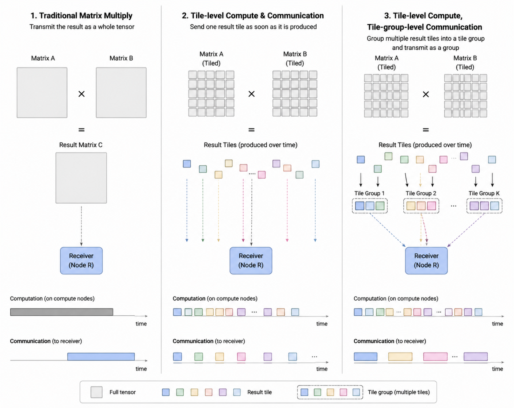

<p align="center">
  
</p>

# TileCCL: Tile-native Collective Communication Library

<div align="center">
  <table>
    <tr>
      <td align="center" width="50%">
        <br/>
        <strong>Institute of Information Engineering</strong><br/>
        Chinese Academy of Sciences<br/>
        <em>State Key Laboratory of Cyberspace Security Defense</em>
      </td>
      <td align="center" width="50%">
        <br/>
        <strong>Institute of Microelectronics</strong><br/>
        Chinese Academy of Sciences<br/>
        <em>Artificial Intelligence Chip and System Research and Development Center</em>
      </td>
    </tr>
  </table>
</div>

## Overview

TileCCL is a tile-native collective communication library for expressing cross-GPU data movement, synchronization, and collective execution directly in Triton. It supports tile-level collectives, GEMM+collective operators, and overlap strategies.


## TileCCL Architecture

<p align="center">
  
</p>


**Frontend input** — TileCCL accepts Triton operator definitions, collective invocations, and fused compute-communication invocations.

**Control plane** — Operation contracts, runtime control, and scheduling policy turn frontend intent into executable communication plans.

**Data plane** — Tile-level memory semantics, synchronization semantics, and collective execution remain explicit inside Triton-resident kernels.

- **Memory semantics** — `tile_remote_load`, `tile_remote_store`, `tile_put`, and `tile_get` provide explicit remote access semantics for peer-accessible tile memory.
- **Synchronization** — `tile_signal`, `tile_wait`, and remote atomic operations provide cross-tile coordination with explicit memory-ordering semantics.
- **Tile collectives** — `tile_allreduce`, `tile_allgather`, `tile_reduce_scatter`, `tile_broadcast`, and `tile_scatter` implement collective algorithms directly at tile granularity.

**Runtime and substrate** — Memory registration, address translation, and transport binding connect tile-level execution to backend communication paths and hardware interconnects.

## Key Feature 1: TileGroup-Based Overlap

TileGroup is the granularity TileCCL uses to overlap GEMM output with communication. Instead of waiting for a whole tensor, ready tiles are grouped into transfer-efficient units and sent as soon as their producer work completes.

- **Balanced granularity** — TileGroups sit between tile-by-tile transfer and bulk tensor transfer.
- **Cost-model planning** — P2P saturation, wave alignment, and pipeline balance guide group boundaries.
- **Device-side progress** — Compute workgroups signal ready groups while communication workgroups move them through peer memory.

### Data Flow

<p align="center">
  
</p>

TileCCL compares three communication granularities: bulk tensor transfer, tile-by-tile transfer, and TileGroup transfer. TileGroup sits between the extremes by assembling tiles into transfer-efficient groups while keeping readiness aligned with the compute schedule.

## Preliminary Results

These v5 proof results were collected on 2x NVIDIA H100 GPUs with NVLink peer access after full Phase0 calibration. The fused proofs use the same Triton persistent GEMM backend across all variants; differences are limited to communication granularity, TileGroup signaling, and device-side P2P communication.

### Gate 1: GEMM-Output AllGather

| Shape MxNxK | S0 Bulk | S1 tile-by-tile | S2 TileCCL | vs S1 | vs S0 |
|:---|---:|---:|---:|---:|---:|
| 16384x4096x1024 | 1.242 ms | 1.167 ms | 0.801 ms | **1.46x** | **1.55x** |
| 8192x4096x2048 | 0.901 ms | 0.757 ms | 0.639 ms | **1.18x** | **1.41x** |
| 8192x4096x1024 | 0.862 ms | 0.676 ms | 0.482 ms | **1.40x** | **1.79x** |

### Gate 2: GEMM to ReduceScatter

| Shape MxNxK_total | S0 Bulk | S1 tile-by-tile | S2 TileCCL | vs S1 | vs S0 |
|:---|---:|---:|---:|---:|---:|
| 16384x4096x2048 | 1.640 ms | 1.091 ms | 0.965 ms | **1.13x** | **1.70x** |
| 8192x4096x4096 | 1.130 ms | 0.757 ms | 0.769 ms | 0.99x | **1.47x** |
| 8192x4096x2048 | 0.986 ms | 0.613 ms | 0.609 ms | **1.01x** | **1.62x** |

## Install

TileCCL requires Python 3.10+, PyTorch >= 2.4, and Triton >= 3.0.

Install from source:

```bash
pip install .
```

For development:

```bash
pip install -e .
```

For development with benchmark dependencies:

```bash
pip install -e ".[dev,benchmark]"
```

## Quick Start

Run the single-process example:

```bash
python examples/single_process.py
```

Run the distributed example:

```bash
torchrun --nproc_per_node=<num_gpus> examples/multiprocess.py
```

More entry points are available under `examples/`.

Minimal single-process usage:

```python
import torch
import tileccl

ctx = tileccl.init(heap_size=512 * 1024 * 1024)
A = ctx.randn(4096, 4096, dtype=torch.float16)
B = ctx.randn(4096, 8192, dtype=torch.float16)
C = ctx.zeros(4096, 8192, dtype=torch.float16)

tileccl.ops.gemm_allscatter(A, B, C, ctx=ctx)
```

TileGroup planning API example:

```python
from tileccl_v2 import (
    build_p2p_transport_plan,
    build_tile_group_plan,
    reduce_scatter_spec,
)

spec = reduce_scatter_spec(world_size=2)
plan = build_tile_group_plan(8192, 4096, 128 * 128 * 2)
transport = build_p2p_transport_plan(comm_mode="push", copy_elems=16384)

print(spec.kind, plan.n_groups, transport.push_mode)
```

## Contributing

See [CONTRIBUTING.md](CONTRIBUTING.md).

## License

[Apache 2.0](LICENSE)
