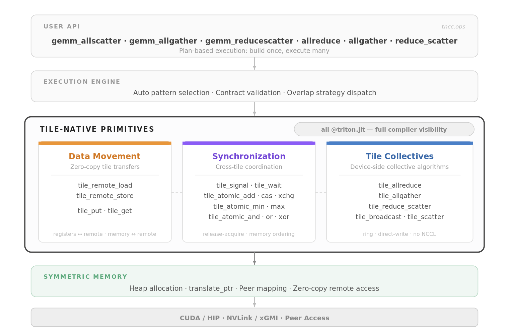
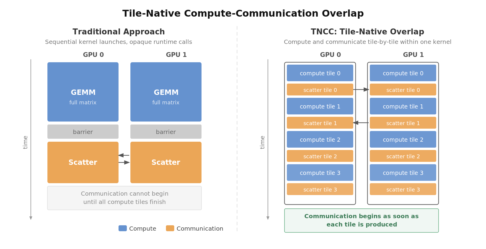

<p align="center">
  
</p>

# TNCC: Tile-Native Collective Communication

TNCC brings collective communication into the tile programming model. Instead of treating communication as opaque runtime calls between kernels, TNCC expresses every collective — allreduce, allgather, reduce-scatter, and fused GEMM+collective — as compiler-visible Triton programs where compute, communication, and synchronization operate at the same tile granularity within a single device-side program.

<p align="center">
  
</p>

## Key Features

Traditional collective libraries (NCCL, NVSHMEM) treat communication as opaque runtime calls invisible to the compiler. TNCC takes a fundamentally different approach — communication is a first-class tile primitive.

- **Three primitive groups form the core.** Data movement (`tile_put`, `tile_get`, `tile_remote_store`), synchronization (`tile_signal`, `tile_wait`, remote atomics), and collectives (`tile_allreduce`, `tile_allgather`, `tile_reduce_scatter`) — all expressed as `@triton.jit` functions that the compiler can see and optimize end-to-end.

- **Zero-copy remote access.** A 5-instruction pointer translation (`translate_ptr`) maps any local heap offset to a peer GPU's address space. No staging buffers, no memcpy intermediaries — the kernel directly reads and writes remote memory.

- **Tile-granularity overlap.** Communication begins the moment a tile is produced, not after the entire matrix is computed. This is the key to hiding communication latency behind useful compute.

- **No opaque runtime.** Ring allreduce, direct-write allgather, atomic reduce-scatter — all implemented as pure Triton programs. The compiler optimizes the full compute-communication graph as a single program.

- **Symmetric memory model.** Identical heaps across GPUs make address translation trivial and enable hardware-level peer access over NVLink or xGMI.

## Quick Start

```bash
pip install -e ".[dev]"
```

```python
import torch
import tncc

ctxs = tncc.init_local(world_size=2, heap_size=512 * 1024 * 1024)
ctx = ctxs[0]

A = ctx.randn(4096, 4096, dtype=torch.float16)
B = ctx.randn(4096, 8192, dtype=torch.float16)
C = ctx.zeros(4096, 8192, dtype=torch.float16)

tncc.ops.gemm_allscatter(A, B, C, ctx=ctx)
```

See [`examples/`](examples/) for single-process, multi-process, and pattern benchmarking scripts.

## Compute-Communication Overlap

TNCC implements four overlap strategies. Each trades off implementation complexity for overlap opportunity — from a bulk-synchronous baseline to SM-partitioned workgroup specialization.

Inspired by [Iris](https://github.com/ROCm/iris) (AMD Research).

<p align="center">
  
</p>

| Pattern | Mechanism | Overlap |
|---------|-----------|---------|
| **BulkSync** | GEMM, barrier, then scatter | None (baseline) |
| **FusedSequential** | Single persistent kernel; compute tile then scatter tile | Tile-level, sequential |
| **ProducerConsumer** | Dual-stream; compute and scatter in parallel | Tile-level, parallel |
| **WG-Specialized** | Single kernel; SMs partitioned into compute and comm workgroups | SM-level, parallel |

Auto-selection chooses the best pattern based on problem shape and hardware:

```python
pattern = ctx.auto_select_pattern("gemm_allscatter", M=M, N=N, K=K)
```

## Supported Operations

| Operation | Contract |
|-----------|----------|
| `gemm_allscatter` | full/full, shard/shard, full/shard |
| `gemm_allgather` | shard/full |
| `gemm_reducescatter` | full/shard |
| `allgather` | &mdash; |
| `allreduce` | in-place |
| `reduce_scatter` | &mdash; |

## Development

```bash
make install-dev   # Install with dev + benchmark dependencies
make test          # Run tests
make lint          # Ruff linter
make bench         # Run benchmarks
```

CLI benchmarking:

```bash
tncc bench pattern --quick    # Compare overlap patterns
tncc bench gemm               # GEMM kernel performance
tncc bench p2p                # P2P bandwidth sweep
tncc bench all                # Run all benchmarks
```

## Requirements

- NVIDIA GPUs with NVLink interconnect (verified on H100 PCIe)
- CUDA 12.x, PyTorch >= 2.4, Triton >= 3.0

## Contributing

See [CONTRIBUTING.md](CONTRIBUTING.md).

## License

[Apache 2.0](LICENSE)
