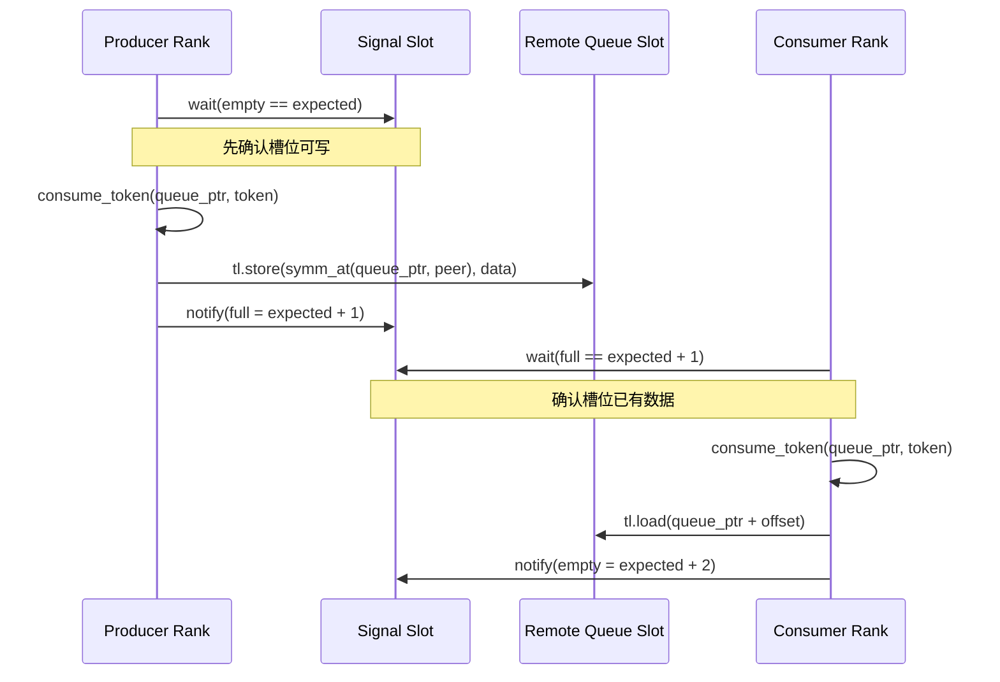

# 四项目全栈差异分析（2026-03-20）

本文只基于当前工作区中的真实源码与结果文件，不按论文愿景或 README 口号做判断。

分析对象：

- `/home/makai/iris/`
- `/home/makai/tilescale/`
- `/home/makai/Triton-distributed/`
- `/home/makai/XTile/`

目标问题：

1. 四者差异化到底在哪。
2. XTile 当前真正的优势在哪。
3. XTile 要如何做得比它们更好。
4. 给出一张可以直接复用的全栈对比 mermaid 图。

## 一句话结论

这四个项目不是“谁把同一件事写得更漂亮”的关系，而是四条不同路线：

- Iris：最像“把跨 GPU 通信退化成远端 load/store”的极简算法体系。
- TileScale：最像“把 distributed primitive 纳入 TileLang/TVM DSL”，但底层通信仍主要依赖 NVSHMEM。
- Triton-distributed：最像“把 distributed wait/notify/symm_at 做进 Triton compiler/IR”。
- XTile：试图把 Iris 的透明性、TileLink 风格信号语义、TileScale 的 primitive 完整性、Triton 的可见性组合到一套 pure Triton 体系里。

如果只看路线正确性，XTile 的方向是四者里最完整的组合型路线；如果看当前工程落地成熟度，XTile 还没有全面领先，尤其在上层 API 收敛、模式性能、collective 可靠性、自动拓扑调度这几项上仍未闭环。

## 对齐坐标

为了避免“拿论文抽象比 repo 现实”，下面统一按六层来对齐：

1. 用户层 API：用户到底写什么。
2. 编译器 / IR 可见性：通信是否被编译器真正看见。
3. 通信 / 同步原语层：核心 primitive 是什么。
4. 对称内存建立路径：远端地址如何变得可访问。
5. overlap 控制权：重叠是硬件自然重叠、软件流水、还是 IR 级同步。
6. 产品化成熟度：今天用户拿仓库能否稳定复现。

## Iris：极简透明，算法感最强，产品边界最薄

### 1. 用户层 API

Iris 的代表性路径不是高层 collective API，而是用户直接写 Triton kernel，在 tile 完成后调用 `iris.store(...)` 做远端写。

源码证据：

- `iris/examples/07_gemm_all_scatter/gemm_all_scatter.py:12-147`
- 关键位置是 `persistent_gemm_all_scatter` 里每个 tile 算完后直接对所有 peer 做 store。

这意味着 Iris 的核心价值不在“给你一个丰富库”，而在“给你一个极薄但正确的远端寻址模型”。

### 2. 编译器 / IR 可见性

Iris 没有单独的 distributed IR 层，本质上还是 plain Triton kernel + 一个可内联的地址翻译 / 远端 store 模式。

优点：

- 模型简单。
- 用户能直接看到数据流。
- compute 和 communication 没有被 opaque runtime call 完全遮住。

短板：

- 编译器没有专门的 distributed scheduling / token / barrier 表达。
- 高层通信结构更多靠用户自己组织。

### 3. 通信 / 同步原语层

Iris 的核心 primitive 是“地址翻译 + 远端 load/store”，而不是先定义一大组 collective / signal DSL。

在 `gemm_all_scatter.py:135-147` 中可以看到：

- 本地 rank 直接 `tl.store(...)`
- 非本地 rank 调 `iris.store(...)`

也就是说，Iris 的心智模型是：

- “远端写”不是另一个黑箱通信系统。
- 它只是对同一块对称堆上不同 rank 基址做 translation 后的 store。

### 4. 对称内存建立路径

Iris 当前 repo 的对称堆不是旧式“只靠 HIP IPC”的单一路径，而是更完整的 allocator + FD passing + DMA-BUF import / map 路线。

源码证据：

- `iris/iris/symmetric_heap.py:15-18`
- `iris/iris/symmetric_heap.py:57-64`
- `iris/iris/symmetric_heap.py:152-258`

从实现看，它至少包含：

- allocator 选择：`TorchAllocator` / `VMemAllocator`
- FD 基础设施：`setup_fd_infrastructure`
- `distributed_allgather` 同步 base address
- `export_dmabuf_handle`
- `mem_import_from_shareable_handle`
- `mem_map`
- `mem_set_access`

这说明 Iris 不是概念样例，而是在 ROCm 路线上把“远端地址真的能访问”这件事做实了。

### 5. overlap 控制权

Iris 的经典优势是 fused sequential 风格：每个 tile GEMM 完成立即 scatter，重叠主要依赖硬件自然 overlap，而不是复杂软件流水。

优点：

- 控制流极短。
- 调试成本低。
- 对用户很透明。

缺点：

- 更复杂的 producer-consumer、WG specialization、拓扑自适应，不是它最强的部分。

### 6. 产品化成熟度

Iris 的思想非常强，但 repo 的整体气质更偏“正确的系统原型 + 算法范式”，不是最完整的工业接口层。

结论：

- 它最强的不是“接口多”，而是“路线极简且成立”。
- 它最弱的不是“做不到”，而是“产品层抽象没有铺得最完整”。

## TileScale：DSL 最宏大，但通信核心仍偏 NVSHMEM opaque call

### 1. 用户层 API

TileScale 给人的第一印象是“抽象很高”，但当前 repo 中 GEMM + RS 的实际 benchmark 写法仍然是：

- `T.copy`
- `T.gemm`
- `T.putmem_nbi_block`

源码证据：

- `tilescale/benchmark/distributed/benchmark_gemm_rs.py:18-63`

其中真正的“scatter”关键动作在：

- `benchmark_gemm_rs.py:58-60`

这说明 repo reality 不是对外已经形成稳定高层 `T.scatter()` 主路径，而是用户仍要显式拼装 distributed primitive。

### 2. 编译器 / IR 可见性

TileScale 的强项是 TileLang / TVM DSL 层能表达 distributed intrinsic。

源码证据：

- `tilescale/tilelang/language/distributed/multi_device/nvshmem.py:6-203`

这里暴露了大量 TIR intrinsic：

- `putmem_nbi_block`
- `putmem_signal_nbi_block`
- `signal_wait_until`
- `barrier_all`
- `fcollect`

也就是说，TileScale 的“强”在于它确实把通信 primitive 提升到了 DSL / compiler 接口层，而不是只在 host runtime 包一层 Python。

### 3. 通信 / 同步原语层

虽然 DSL 层很强，但通信动作的执行语义仍高度绑定 NVSHMEM。

从 `nvshmem.py` 看，很多操作本质上就是对 `tl.*` distributed op 的 TIR intrinsic 包装，而这些 op 对用户来说仍然偏底层：

- 用户需要知道 `putmem_*`
- 用户需要知道 `signal_*`
- 用户需要知道 `barrier_*`

这和“真正顺手的高层分布式 tile API”之间还有距离。

### 4. 对称内存建立路径

TileScale 当前初始化路线清楚地依赖：

- `torch.distributed.init_process_group`
- `pynvshmem.init_nvshmem_by_uniqueid`

源码证据：

- `tilescale/tilelang/distributed/utils.py:66-97`

这说明它的分布式可访问内存不是自己定义一套透明 symmetric heap 语义，而是主要站在 NVSHMEM runtime 上。

同时它也有 IPC handle 辅助工具：

- `tilescale/tilelang/distributed/utils.py:100-129`

但总体上，用户能否成功跑起来，和 NVSHMEM 环境正确性高度耦合。

### 5. overlap 控制权

TileScale 的 overlap 更偏“用户在 DSL 中显式拼装流水”。

优点：

- 灵活。
- 可扩展到更多 primitive 组合。
- 容易和更大的 TileLang 编译体系结合。

短板：

- 用户心智负担仍重。
- 通信 primitive 透明度不如 Iris。
- 用户看到的是 `putmem_nbi_block`，不是“远端 tile 就像本地 tile 一样自然”。

### 6. 产品化成熟度

TileScale 的编译器叙事最完整，但仓库现实说明它当前最强的是“分布式 primitive 编译接口”，不是“已经完成高层用户体验封装”。

结论：

- 它的核心差异化在 DSL / compiler 宽度。
- 它的核心短板在通信底层仍明显依赖 NVSHMEM 黑箱能力。

## Triton-distributed：编译器整合最深，但高层 primitive 仍未公开完备

### 1. 用户层 API

Triton-distributed 今天公开给用户的主路径仍然偏 low-level。

官方文档已经写明：

- 当前公开的是 `Low-level primitives`
- 高层 tile-centric primitive “will be released soon”

源码证据：

- `Triton-distributed/docs/primitives.md:1-59`

这是一个非常关键的事实：论文里的高层抽象，不等于 repo 里今天已经稳定可用的用户接口。

### 2. 编译器 / IR 可见性

四个项目里，Triton-distributed 在“distributed 真进 compiler/IR”这件事上是最深入的。

源码证据：

- `Triton-distributed/python/src/ir.cc:251-283`

这里明确有：

- `WaitOp`
- `ConsumeTokenOp`
- `GetRankOp`
- `GetNumRanksOp`
- `SymmAtOp`
- `NotifyOp`

这说明它不是“库层面模拟 distributed primitive”，而是把 distributed 语义提升成 Triton 编译链的一部分。

这是真正的护城河。

### 3. 通信 / 同步原语层

教程里的真实风格是：

- `dl.wait`
- `dl.consume_token`
- `dl.symm_at`
- `dl.notify`
- `libshmem_device.fence`

源码证据：

- `Triton-distributed/tutorials/01-distributed-notify-wait.py:63-146`

这套模型很强，但也说明当前用户面对的是一套偏底层 producer-consumer token 编程模型，而不是“开箱即用的高层 fused collective API”。

### 4. 对称内存建立路径

当前 runtime 初始化主要依赖 NVSHMEM / ROCSHMEM backend。

源码证据：

- `Triton-distributed/python/triton_dist/utils.py:187-239`

其中最重要的是：

- `init_rocshmem_by_torch_process_group`
- `init_nvshmem_by_torch_process_group`
- `nvshmem_create_tensor`

启动脚本则是典型 `torchrun` 包装：

- `Triton-distributed/scripts/launch.sh:163-173`

这说明 Triton-distributed 的优势不在“最轻运行时”，而在“编译器知道 distributed 语义”。

### 5. overlap 控制权

Triton-distributed 的 overlap 控制粒度可以做得很细，因为 wait/notify/token 进入了 IR。

优点：

- 编译器和程序员都能看见同步边界。
- 适合复杂流水、生产者消费者、异步队列。

短板：

- 写法重。
- 普通用户上手门槛高。
- 高层 primitive 没完全公开之前，心智成本偏大。

### 6. 产品化成熟度

Triton-distributed 在技术深度上很强，但今天 repo 给普通用户的体验仍更偏研究型高级工具，而不是最顺手的普及型通信库。

结论：

- 它最强的是 compiler/IR 级 distributed integration。
- 它最弱的是高层 API 仍未完全释放，用户心智成本高。

## XTile：组合路线最完整，但还没把“正确架构”彻底打磨成“压倒性产品”

### 1. 用户层 API

XTile 对外叙事是：

- `xtile.init`
- `xtile.SymmetricHeap`
- `xtile.patterns.auto_select`

源码证据：

- `XTile/README.md:17-45`
- `XTile/xtile/__init__.py:30-137`

但当前 repo 现实里，上层 API 其实还没有完全收敛：

- `XTileContext` 只包含 `rank/world_size/device/backend/topology`
- 不直接携带 heap / remote ptr / stream / launcher state
- `Tile` 还是临时 alias 到 `SymmetricHeap`

关键证据：

- `xtile/__init__.py:31-52`
- `xtile/__init__.py:209-223`

这意味着 XTile 的“最终用户 API”愿景是对的，但今天还没完全成型。

### 2. 编译器 / IR 可见性

XTile 当前最大的架构优点，是它把通信 primitive 直接写在 pure Triton 中，而不是退回 opaque runtime call。

源码证据：

- `xtile/memory/translation.py:38-99`
- `xtile/primitives/communication.py:31-225`
- `xtile/primitives/collectives.py:72-220`

这带来三个结果：

- compute / communication 在同一套 Triton 语义里。
- 编译器至少能看到地址翻译、load/store、原子与控制流。
- 不需要把核心 primitive 交给 NVSHMEM device library 黑箱决定。

这点是 XTile 相对 TileScale 的关键优势之一。

### 3. 通信 / 同步原语层

XTile 当前比另外三者更完整的一点，是它已经形成了三层清晰分层：

1. 地址层：`translate_ptr`
2. 通信层：value-based + pointer-based remote primitive
3. 同步层：remote atomics 与 local signal/wait 分离

源码证据：

- 地址翻译：`xtile/memory/translation.py:38-99`
- value-based / pointer-based：`xtile/primitives/communication.py:31-225`
- TileLink 风格本地 signal/wait：`xtile/sync/primitives.py:343-419`

这里真正有价值的不是“原语数量多”，而是语义边界更清晰：

- 远端读写、远端原子，属于跨 GPU primitive。
- `tile_signal/tile_wait` 明确只对本地可见地址生效。
- 跨 GPU signal 需要先 translation，再复用同一同步 primitive。

这让系统更容易维护和验证，不容易把“本地同步”和“跨设备同步”混成一团。

### 4. 对称内存建立路径

XTile 的 symmetric heap 设计是当前 repo 中最值得保留的工程资产之一，因为它明确支持两种模式：

- 单进程多 GPU：`create_all()` + peer access
- 多进程：IPC 交换 + fallback

源码证据：

- `xtile/memory/symmetric_heap.py:4-27`
- `xtile/memory/symmetric_heap.py:184-266`
- `xtile/memory/symmetric_heap.py:270-319`

更重要的是，它不是只写了一条理想路径，而是明确列了多进程三策略：

1. raw ctypes IPC
2. PyTorch IPC
3. peer-access pointer exchange fallback

这比“只依赖某一个 runtime 成功初始化”更像工业工程思路。

### 5. overlap 控制权

XTile 现在已经把多种 overlap pattern 放进同一工程：

- `bulk_sync`
- `fused_sequential`
- `producer_consumer`
- `wg_specialized`

源码证据：

- `xtile/patterns/__init__.py:1-152`
- `xtile/patterns/fused_sequential.py:37-227`
- `xtile/patterns/auto_select.py:39-189`

其中 `fused_sequential` 的确在直接复现 Iris 风格：每个 tile 算完立即 scatter。

证据：

- `xtile/patterns/fused_sequential.py:152-227`

这意味着 XTile 不只是“做 primitives”，而是在往“primitive + pattern library + auto select”走。

### 6. 产品化成熟度

XTile 的问题不在架构方向，而在证据闭环还不够硬。

已有正面证据：

- P2P bandwidth 在 H100 PCIe x2 / NV12 上做到约 `248.8 GB/s` 读、`248.6 GB/s` 写。
- 对 300 GB/s 理论峰值约 `82.9% / 82.9%`。

源码证据：

- `results/phase5_p2p.txt:1-19`

但也有明确短板证据：

- 最新 full 6-size rerun 已经做到 `1.667x`，但优势并非所有尺寸都同样稳定
- P2P 与 8192³ GEMM 这两个更底层指标仍未达目标
- 某些尺寸下 symmetric heap 直接耗尽的问题已经由动态 heap sizing 修复，但 allocator-first canonical layer 仍未完成

源码证据：

- `results/phase5_patterns_full.txt:10-18`
- `results/phase5_patterns_full.txt:34-40`

这说明 XTile 目前还不能声称“性能层面全面赢了”。当前更准确的说法应该是：

- primitive 路线成立
- 体系组合完整
- 但 pattern 和产品层还没完全收口

## 代码示例化全栈流程

下面这一节参考 [GEMM_AllScatter_四系统全栈对比_修订版](/home/makai/XTile/docs/GEMM_AllScatter_四系统全栈对比_修订版.md) 的表达方式，但严格按当前四个仓库里的真实代码风格来写。

说明：

- 目标是把“用户代码 -> 编译器可见层 -> 通信 primitive -> 内存建立 -> 硬件执行”串成一条代码化链路。
- 代码块尽量贴近当前 repo reality。
- 为了压缩篇幅，少量细节会用注释省略，但不会把不存在的一键 API 写成已落地接口。

### Iris：用户直接在 Triton kernel 里完成 GEMM 后远端写

下面这段最接近当前 `examples/07_gemm_all_scatter/gemm_all_scatter.py` 的真实风格。

```python
import torch
import triton
import triton.language as tl
import iris


# Layer 1: host-side 初始化
heap = iris.iris(heap_size=1 << 30)
A = heap.randn((M, K), dtype=torch.float16)
B = heap.randn((K, N), dtype=torch.float16)
C = heap.zeros((M, N * world_size), dtype=torch.float16)
heap_bases = heap.get_heap_bases()


@triton.jit
def persistent_gemm_all_scatter(
    A, B, C, M, N, K,
    stride_am, stride_ak, stride_bk, stride_bn,
    stride_cm_global, stride_cn_global,
    heap_bases, cur_rank: tl.constexpr, world_size: tl.constexpr,
    BLOCK_M: tl.constexpr, BLOCK_N: tl.constexpr, BLOCK_K: tl.constexpr,
    NUM_SMS: tl.constexpr,
):
    pid = tl.program_id(0)
    total_tiles = tl.cdiv(M, BLOCK_M) * tl.cdiv(N, BLOCK_N)

    for tile_id in range(pid, total_tiles, NUM_SMS):
        # GEMM 部分
        acc = tl.zeros((BLOCK_M, BLOCK_N), dtype=tl.float32)
        # ... 省略 A/B tile 地址计算 ...
        # ... 省略 K 维循环 ...
        c = acc.to(tl.float16)

        # Layer 2: 用户自己在 kernel 中直接组织 distributed 写回
        # 当前 Iris 的真实优势就在这里：
        # “通信”没有单独隐藏成另外一套 opaque runtime kernel
        global_offset = rm[:, None] * stride_cm_global + \
            (rn[None, :] + cur_rank * N) * stride_cn_global
        mask = (rm[:, None] < M) & (rn[None, :] < N)

        for remote_rank in range(world_size):
            if remote_rank == cur_rank:
                tl.store(C + global_offset, c, mask=mask)
            else:
                iris.store(
                    C + global_offset,
                    c,
                    cur_rank,
                    remote_rank,
                    heap_bases,
                    mask=mask,
                )


# Layer 3: 编译器可见层
# Triton JIT 看到的不是 NCCL/NVSHMEM 黑箱，而是：
#   iris.store(...) -> translate(pointer) + tl.store(...)


# Layer 4: 内存建立
# 当前 SymmetricHeap 主路径更接近：
#   allocator 选择
#   -> setup_fd_infrastructure(...)
#   -> distributed_allgather(base addresses)
#   -> export_dmabuf_handle / mem_import_from_shareable_handle / mem_map
#   -> 形成 heap_bases tensor


# Layer 5: 硬件执行
# translated_ptr 指向远端 rank 的 heap 段；
# 最终仍是一条普通 store 指令打到远端可访问地址。
```

这条路线的关键，不是 API 多，而是用户在 kernel 里直接掌控 tile 级 compute 和 remote store 的交织方式。

### TileScale：用户写 TileLang，通信核心仍落到 NVSHMEM 风格 primitive

下面这段最接近当前 `benchmark/distributed/benchmark_gemm_rs.py` 的真实写法。当前公开 repo 里更直接、可验证的是 GEMM + ReduceScatter 路径，但它足以展示 TileScale 的全栈通信链路。

```python
import torch
import torch.distributed as dist
import pynvshmem
import tilelang
import tilelang.language as T

from tilelang.distributed import init_distributed


# Layer 1: host-side 初始化
WORLD_SIZE, RANK, LOCAL_RANK, TP_GROUP = init_distributed(return_tp_group=True)
input = torch.randn((M, K_per_rank), dtype=torch.float16, device="cuda")
weight = torch.randn((N, K_per_rank), dtype=torch.float16, device="cuda")
gemm_output = pynvshmem.nvshmem_create_tensor_list_intra_node(
    [M_blocks, N_blocks, block_M, block_N],
    dtype=input.dtype,
)


@tilelang.jit(pass_configs={"tl.disable_rdc": True})
def fused_gemm_scatter(
    rank, num_ranks, M, N, K_per_rank,
    block_M, block_N, block_K,
):
    @T.prim_func
    def nonpersistent_kernel(A, B, C):
        with T.Kernel(N_blocks, M_blocks, threads=128) as (bx, by):
            A_shared = T.alloc_shared((block_M, block_K), "float16")
            B_shared = T.alloc_shared((block_N, block_K), "float16")
            C_local = T.alloc_fragment((block_M, block_N), "float32")
            C_shared = T.alloc_shared((block_M, block_N), "float16")

            for k in T.Pipelined(K_stages, num_stages=3):
                T.copy(A[by * block_M, k * block_K], A_shared)
                T.copy(B[bx * block_N, k * block_K], B_shared)
                T.gemm(A_shared, B_shared, C_local, transpose_B=True)

            T.copy(C_local, C_shared)
            T.copy(C_shared, C[by, bx, :, :])

            peer = by // M_blocks_per_rank
            T.putmem_nbi_block(
                T.address_of(C[by, bx, 0, 0]),
                T.address_of(C[by, bx, 0, 0]),
                block_M * block_N * 2,
                peer,
            )

    return nonpersistent_kernel


# Layer 2: 编译器可见层
# 用户写的是 TileLang DSL / TIR intrinsic。
# 但真正远端写的动作，在当前 repo reality 中仍然体现为：
#   T.putmem_nbi_block(...)


# Layer 3: 通信 primitive
# TileScale 暴露了大量 distributed intrinsic：
#   putmem_* / getmem_* / signal_* / barrier_* / fcollect
# 这说明它强在 DSL primitive 面，但底层语义仍明显绑定 NVSHMEM。


# Layer 4: 内存建立
# init_distributed(...) 内部更接近：
#   torch.distributed.init_process_group(...)
#   -> pynvshmem.init_nvshmem_by_uniqueid(TP_GROUP)
#   -> 由 NVSHMEM runtime 建立对称可访问区域


# Layer 5: 硬件执行
# 最终 kernel 落地到包含 NVSHMEM 调用语义的设备端执行路径。
# 也就是说，用户和编译器之间多了一层 SHMEM runtime 语义。
```

TileScale 的强项在 DSL 宽度，但当前 repo reality 里，通信核心并没有被简化成 Iris 那种“远端地址上的普通 store 心智模型”。

### Triton-distributed：用户显式写 wait / notify / symm_at，编译器直接持有 distributed 语义

下面这段最接近当前 `tutorials/01-distributed-notify-wait.py` 的真实路径。它不靠高层 `BlockChannel` API，而是直接展示今天仓库里公开可见的 low-level distributed 模型。

```python
import torch
import triton.language as tl
import triton_dist
import triton_dist.language as dl

from triton_dist.language.extra import libshmem_device
from triton_dist.utils import (
    NVSHMEM_SIGNAL_DTYPE,
    initialize_distributed,
    nvshmem_create_tensor,
    nvshmem_barrier_all_on_stream,
)


# Layer 1: host-side 初始化
TP_GROUP = initialize_distributed()
queue = nvshmem_create_tensor((QUEUE_SIZE * BLOCK_SIZE,), torch.float32)
signal = nvshmem_create_tensor((QUEUE_SIZE,), NVSHMEM_SIGNAL_DTYPE)
queue.fill_(-1)
signal.fill_(0)
nvshmem_barrier_all_on_stream(torch.cuda.current_stream())


@triton_dist.jit
def producer_consumer_kernel(
    rank: tl.constexpr,
    num_ranks: tl.constexpr,
    input_ptr,
    output_ptr,
    num_inputs,
    queue_ptr,
    signal_ptr,
    queue_size: tl.constexpr,
    BLOCK_SIZE: tl.constexpr,
):
    pid = tl.program_id(0)
    peer_rank = (rank + 1) % num_ranks

    if pid < NUM_PRODUCER_SMS:
        for i in range(pid, num_inputs, NUM_PRODUCER_SMS):
            queue_offset = i % queue_size
            queue_repeat = i // queue_size

            token = dl.wait(
                dl.symm_at(signal_ptr, peer_rank) + queue_offset,
                1,
                "gpu",
                "acquire",
                waitValue=queue_repeat * 2,
            )
            input_ptr = dl.consume_token(input_ptr, token)

            data = tl.load(input_ptr + i * BLOCK_SIZE + tl.arange(0, BLOCK_SIZE))
            tl.store(
                dl.symm_at(queue_ptr, peer_rank) + queue_offset * BLOCK_SIZE + tl.arange(0, BLOCK_SIZE),
                data,
            )
            libshmem_device.fence()
            dl.notify(
                signal_ptr + queue_offset,
                peer_rank,
                signal=queue_repeat * 2 + 1,
                sig_op="set",
                comm_scope="intra_node",
            )


# Layer 2: 编译器可见层
# Triton-distributed 的关键优势在这里：
#   dl.wait      -> WaitOp
#   dl.consume_token -> ConsumeTokenOp
#   dl.symm_at   -> SymmAtOp
#   dl.notify    -> NotifyOp
# 这些 distributed 语义被直接提升进 Triton 编译器 / IR。


# Layer 3: 通信 primitive
# 当前 repo 已公开的主路径是：
#   wait / notify / consume_token / symm_at
#   + libshmem_device.* / NVSHMEM device primitives


# Layer 4: 内存建立
# 更接近：
#   torch process group
#   -> init_nvshmem_by_torch_process_group(pg)
#   -> nvshmem_create_tensor(...)


# Layer 5: 硬件执行
# 最终落地到 SHMEM backend 管理的远端可见地址与信号对象，
# 但与 TileScale 不同的是，编译器已经知道 wait/notify 这些同步语义。
```

Triton-distributed 的壁垒不在“高层接口最简洁”，而在“distributed 语义已经进入 compiler IR，而不是只停留在 runtime call”。

### XTile：当前最可信的现实路径是 symmetric heap + pure Triton primitive 直连

这一段必须和参考文档不同。参考文档里有一些目标态一键 API，但当前仓库里更可信、也更贴近 reality 的全栈路径是：

- host 上先建 `SymmetricHeap`
- device 上直接用 `translate_ptr` / `tile_remote_store` / `tile_signal` / `tile_wait`
- pattern 层是已经存在的，但统一 runtime context 还没完全收口

```python
import torch
import triton
import triton.language as tl

from xtile.memory.symmetric_heap import SymmetricHeap
from xtile.primitives.communication import tile_remote_store
from xtile.sync.primitives import tile_signal, tile_wait


# Layer 1: host-side 初始化
# 单进程多 GPU 现实路径：先创建所有 heap，再拿每个 rank 的 heap_bases
heaps = SymmetricHeap.create_all(size=1 << 30, world_size=2, backend="cuda")
rank = 0
heap = heaps[rank]
heap_bases = heap.get_heap_bases()

A = heap.allocate_tensor((M, K), dtype=torch.float16)
B = heap.allocate_tensor((K, N), dtype=torch.float16)
C = heap.allocate_tensor((M, N), dtype=torch.float16)
locks = heap.allocate_tensor((num_tiles,), dtype=torch.int32)


@triton.jit
def fused_gemm_scatter_kernel(
    A_ptr, B_ptr, C_ptr,
    heap_bases, rank, world_size,
    M, N, K,
    stride_am, stride_ak, stride_bk, stride_bn,
    stride_cm, stride_cn,
    BLOCK_M: tl.constexpr, BLOCK_N: tl.constexpr, BLOCK_K: tl.constexpr,
):
    pid = tl.program_id(0)
    total_tiles = tl.cdiv(M, BLOCK_M) * tl.cdiv(N, BLOCK_N)

    for tile_id in range(pid, total_tiles, NUM_SMS):
        # 省略 GEMM tile 地址计算
        acc = tl.zeros((BLOCK_M, BLOCK_N), dtype=tl.float32)
        # ... 省略 K 维 dot 累加 ...
        result = acc.to(C_ptr.dtype.element_ty)

        offs_m = ...
        offs_n = ...
        offsets = offs_m[:, None] * stride_cm + offs_n[None, :] * stride_cn
        mask = (offs_m[:, None] < M) & (offs_n[None, :] < N)

        # 先本地写回
        tl.store(C_ptr + offsets, result, mask=mask)

        # Layer 2: 直接使用 pure Triton 远端写 primitive
        for peer in range(world_size):
            if peer != rank:
                tile_remote_store(
                    C_ptr,
                    result,
                    rank,
                    peer,
                    heap_bases,
                    offsets,
                    mask=mask,
                    CACHE_MODIFIER=".wt",
                )


@triton.jit
def producer_kernel(C_ptr, locks_ptr, ...):
    # XTile 的另一条现实能力线：
    # 同一套系统还提供本地 producer-consumer 信号原语
    tile_signal(locks_ptr, tile_id, sem="release", scope="gpu")


@triton.jit
def consumer_kernel(C_ptr, locks_ptr, heap_bases, rank, world_size, ...):
    tile_wait(locks_ptr, tile_id, sem="acquire", scope="gpu")
    for peer in range(world_size):
        if peer != rank:
            tile_remote_store(
                C_ptr,
                tile_value,
                rank,
                peer,
                heap_bases,
                offsets,
                mask=mask,
            )


# Layer 3: 编译器可见层
# XTile 当前的核心价值在于：
#   tile_remote_store -> translate_ptr + tl.store
#   tile_signal       -> tl.atomic_xchg
#   tile_wait         -> tl.atomic_cas 自旋
# 编译器能看到地址翻译、原子和控制流，不依赖 opaque SHMEM device call。


# Layer 4: 内存建立
# 单进程路径：
#   SymmetricHeap.create_all(...)
#   -> enable peer access
#   -> 分别分配各 GPU heap buffer
#   -> 为每个 rank 构造 heap_bases tensor
#
# 多进程路径：
#   -> raw ctypes IPC
#   -> PyTorch IPC
#   -> peer-access pointer exchange fallback


# Layer 5: 硬件执行
# translate_ptr 算出远端 rank 在本地址空间中的映射指针后，
# 最终仍是普通 tl.store / tl.atomic_* 对远端可访问地址生效。
```

XTile 现在最值得保留的，并不是某个单独 pattern 名字，而是这条统一路线：

- 内存建立是自己的 `SymmetricHeap`
- 通信 primitive 是自己的 pure Triton 实现
- 同步语义分成本地 signal/wait 和远端原子两层
- 未来如果上层 API 收敛，这条链路最容易长成工业库

## 四者差异化到底在哪

如果把四者的差异压缩成最本质的一句话：

- Iris 的差异化：把分布式通信变成“远端地址可见后的普通 memory op”。
- TileScale 的差异化：把 distributed primitive 提升进 TileLang/TVM DSL 体系。
- Triton-distributed 的差异化：把 distributed 语义提升进 Triton compiler / IR。
- XTile 的差异化：用 pure Triton 把“透明地址翻译 + 通信 primitive + 本地信号语义 + pattern library + collectives”合成一套统一系统。

进一步说，四者不是同一个竞争面：

- Iris 赢在“透明与极简”
- TileScale 赢在“DSL 宽度”
- Triton-distributed 赢在“IR 深度”
- XTile 想赢在“统一性与可维护性”

## Iris 与 Triton-distributed：为什么都“可见”，优势却不一样

很多人第一次看这两个项目，会觉得它们都满足“编译器能看到通信操作”，所以差别应该不大。这个判断不够精确。

更准确的说法是：

- Iris 是“结构可见”。
- Triton-distributed 是“语义可见”。

### Iris：结构可见

Iris 的核心路径是：

- `iris.store(...)`
- 内部展开成 `__translate(...) + tl.store(...)`

源码证据：

- `iris/iris/iris.py:1278-1288`
- `iris/iris/iris.py:1887-1918`
- `iris/examples/07_gemm_all_scatter/gemm_all_scatter.py:135-147`

这意味着编译器真正看到的是：

- 两次 base address load
- 一次 offset 计算
- 一次普通 `tl.store`

所以 Iris 的通信“可见性”本质上是：

- 编译器看见了通信展开后的普通内存访问结构
- 但它没有额外持有“这是 wait / notify / token / queue 协议”的高级分布式语义

这条路线的优势是：

- 极简
- 很容易和普通 Triton kernel 融合
- 用户心智负担低
- 对 fused GEMM + immediate scatter 这类模式特别自然

### Triton-distributed：语义可见

Triton-distributed 的核心路径不是把所有通信都退化成普通 `tl.load/tl.store`，而是把分布式协议语义本身做进编译器。

源码证据：

- `Triton-distributed/docs/primitives.md:3-17`
- `Triton-distributed/python/src/ir.cc:251-283`

这里编译器直接持有：

- `WaitOp`
- `ConsumeTokenOp`
- `SymmAtOp`
- `NotifyOp`

也就是说，编译器看到的不是“几条已经展开好的普通指令”而已，而是：

- 这是一个等待动作
- 这是一个 token 依赖
- 这是一个对称地址映射
- 这是一个远端通知动作

这条路线的优势是：

- 更适合显式 producer-consumer 协议
- 更适合复杂 queue / token / 多阶段流水
- 更容易做编译器级 distributed scheduling / reordering / legality 分析

### 一句话区分

- Iris：编译器看到的是“通信展开后的结构”
- Triton-distributed：编译器看到的是“通信协议本身的语义”

所以两者不是高下立判，而是适合不同类型的问题：

- 如果是 `tile 算完 -> 直接远端写出去` 这种直线型模式，Iris 路线往往更自然。
- 如果是 `队列 / 空满槽 / token / producer-consumer / 多阶段异步流水`，Triton-distributed 的表达力上限更高。

## `wait / consume_token / symm_at / notify` 到底是什么，它们和 `load/store` 的区别是什么

最短理解可以先记成一句话：

- `load/store` 是搬数据
- `symm_at` 是算远端地址
- `wait/notify` 是管“什么时候可以读写”
- `consume_token` 是把“这次等待”与“后续访问”绑定起来

### `load/store`：只管 payload，不管协议

`tl.load(ptr)` 和 `tl.store(ptr, value)` 只回答两个问题：

- 从哪个地址读
- 往哪个地址写

它们不负责回答：

- 这个地址是不是另一个 rank 的对称地址
- 对方现在能不能读
- 你写完以后，对方是否已经被通知
- 编译器是否知道“这次访问必须发生在 wait 之后”

### `symm_at(ptr, rank)`：把“本地模板地址”映射到目标 rank 的对应地址

源码证据：

- `Triton-distributed/python/triton_dist/language/distributed_ops.py:95-99`

它本身不搬数据，只是做地址映射。

可以把它理解成：

- `queue_ptr` 是“每个 rank 上都有一份同布局 queue”的本地地址模板
- `symm_at(queue_ptr, peer_rank)` 是“peer_rank 那份 queue 在我当前视角下对应的地址”

它和 Iris 的 pointer translation 是同类问题，只是 Triton-distributed 把它提成了显式 distributed primitive。

### `wait(...)`：等待某个 signal / barrier word 变成期望值

源码证据：

- `Triton-distributed/python/triton_dist/language/distributed_ops.py:56-70`

它等的不是 payload 数据，而是“条件成立”。

在 tutorial 里：

- producer 先等“槽位空”
- consumer 再等“槽位满”

证据：

- `Triton-distributed/tutorials/01-distributed-notify-wait.py:88-99`
- `Triton-distributed/tutorials/01-distributed-notify-wait.py:126-134`

### `notify(...)`：更新远端 signal，告诉对方状态变了

源码证据：

- `Triton-distributed/python/triton_dist/language/distributed_ops.py:102-111`

它写的是 signal，不是 payload。

在 tutorial 里：

- producer 把数据写到远端 queue 后，再 `notify(...)` 对方“这个槽位现在有数据了”
- consumer 消费后，再 `notify(...)` 回来“这个槽位重新可用了”

证据：

- `Triton-distributed/tutorials/01-distributed-notify-wait.py:101-116`
- `Triton-distributed/tutorials/01-distributed-notify-wait.py:135-146`

### `consume_token(value, token)`：把后续访问显式绑定到这次 wait 的结果上

源码证据：

- `Triton-distributed/python/triton_dist/language/distributed_ops.py:73-80`

它不是再等一次，也不是在搬数据。

它更接近“顺序依赖钉子”：

- `wait(...)` 返回一个 token
- `consume_token(ptr, token)` 告诉编译器：后面对 `ptr` 的使用必须建立在这个 wait 已经完成的前提下

tutorial 里的注释本身就在强调这一点：

- “consume the token to make sure the `wait` is needed”

证据：

- `Triton-distributed/tutorials/01-distributed-notify-wait.py:97-99`

### 为什么不能只用 `load/store`

如果你只写：

```python
tl.store(dl.symm_at(queue_ptr, peer_rank) + offset, data)
```

你只表达了：

- “把数据写到对方 queue”

但没有表达：

- 对方什么时候可以读
- 这个槽位当前是不是空的
- 读写双方是否遵守同一个空/满协议
- 编译器是否知道这个 store 必须晚于某次 wait

所以 Triton-distributed 的完整写法更像：

```python
token = dl.wait(
    dl.symm_at(signal_ptr, peer_rank) + queue_offset,
    1,
    "gpu",
    "acquire",
    waitValue=expected,
)
queue_ptr = dl.consume_token(queue_ptr, token)
tl.store(
    dl.symm_at(queue_ptr, peer_rank) + queue_offset * BLOCK_SIZE + offs,
    data,
)
dl.notify(
    signal_ptr + queue_offset,
    peer_rank,
    signal=new_value,
    sig_op="set",
    comm_scope="intra_node",
)
```

这段代码表达的是一个完整协议：

1. 先等待条件成立
2. 把后续访问绑定到这次等待
3. 算出远端对应地址
4. 真正写 payload
5. 通知对方状态已经变化

### 一个最小生产者-消费者时序图

下面这张图对应的就是 Triton-distributed tutorial 里的基本心智模型。



如果拿 Iris 来对照，这张图里最接近 Iris 强项的部分是：

- `symm_at(...) + tl.store(...)` 这一段“远端地址访问”

而 Triton-distributed 额外强化的是：

- `wait`
- `consume_token`
- `notify`

也就是整套 producer-consumer 协议控制面。

## XTile 当前真正的优势

下面这些优势是我认为可以站得住脚的，不是宣传词。

### 优势 1：核心通信 primitive 是 pure Triton，不依赖 opaque device library 才能表达

这点让 XTile 和 TileScale / Triton-distributed 的 NVSHMEM 路线形成了明显差异。

价值：

- 更透明。
- 更容易跨 NVIDIA / AMD 做统一语义。
- 更利于后续编译器优化与调试。

### 优势 2：value-based 与 pointer-based 双 API 同时存在

源码证据：

- `xtile/primitives/communication.py:31-225`

这意味着 XTile 不是只支持一种通信风格：

- 小 tile、寄存器驻留场景，可以 value-based。
- 大 tile、memory-to-memory 场景，可以 pointer-based。

这比 Iris 当前主打的一条极简路径更完整。

### 优势 3：本地 signal/wait 与远端原子显式分层

源码证据：

- `xtile/sync/primitives.py:343-419`

这点很重要，因为很多 distributed runtime 最后都死在“同步语义混乱”上。

XTile 当前把这件事说清楚了：

- 本地 TileLink 风格信号，负责 kernel 内 / 本地可见地址的 producer-consumer。
- 跨 GPU 同步，先 translation，再用远端地址上的原语。

这会直接决定系统未来是否能稳定扩展。

### 优势 4：symmetric heap 双模式设计比多数原型更接近工业实现

源码证据：

- `xtile/memory/symmetric_heap.py:184-319`

同一个抽象兼容：

- 单进程 peer access
- 多进程 IPC
- fallback 策略

这比“只能在特定 runtime 成功初始化”更容易扩展到真实部署。

### 优势 5：collective 已进入同一透明 primitive 体系

源码证据：

- `xtile/primitives/collectives.py:72-220`

虽然还需要继续验证，但方向上它已经比“primitive 一套、collective 另一个黑箱库”更统一。

## XTile 当前不能自欺的短板

### 短板 1：高层 API 主链已经形成，但还没有真正闭环

这条短板在 2026-03-20 已经**收缩了一大半**：

- `XTileContext` 现在已经持有 `backend`、可选 `heap`、`heap_bases`
- `xtile.init(..., heap_size=...)` 与 `xtile.init_local(...)` 已经能返回可直接用于 pattern 的真实 runtime context
- `ctx.empty/zeros/randn/barrier/auto_select_pattern` 已经打通

但它仍未完全闭环，因为：

- `xtile.ops.gemm_allscatter(...)`、`xtile.ops.allgather(...)`、`xtile.ops.reduce_scatter(...)` 已落地，但 `xtile.ops.gemm_reducescatter(...)` 仍未完成
- mixed layout wrapper 只补上了一半：`full/shard` 已由高层 host wrapper 打通；而 `shard/full` 经真实 2-GPU 诊断后确认不应继续塞进 `gemm_allscatter(...)`，应转入 future `gemm_allgather` 风格 contract
- `pattern.execute(...)` 仍然作为 expert surface 暴露，公共入口还没有完全收口到高层 op API

### 短板 2：auto_select 现在更像启发式规则，不是可证明可靠的调度系统

证据：

- `xtile/patterns/auto_select.py:124-189`

目前主要还是 hard-coded heuristic。它对路线探索有帮助，但还不是工业级自动选择器。

### 短板 3：pattern 性能已经证明有价值，但稳定性还没有完全站稳

证据：

- `results/phase5_patterns_full.txt:34-40`
- `docs/experiment_log.md` 中 2026-03-20 的统一 runtime 全量复测

旧数据里最好曾到 `1.067x`，更早一轮统一 runtime 复测里也出现过 `1.004x` 的保守结果；但在显式 contract + plan-builder 主链稳定后，当前 full 6-size rerun 的最新 headline 已经更新为 `1.667x`。

这说明 XTile 的 overlap pattern 已经不再是“只能跑、但证明不了价值”，而是“已经能在真实工作负载上明显赢 baseline”；当前真正的短板变成了自动选择稳定性、mixed-layout 收口，以及更底层的 P2P / 8192³ GEMM 指标还没一起站稳。

### 短板 4：collective 目前是“有实现”，还不是“已经完成工业证明”

从 `collectives.py` 看，仍有明显 TODO，且很多步骤依赖静态 ring 和 `tl.debug_barrier()`。

证据：

- `xtile/primitives/collectives.py:124-127`
- `xtile/primitives/collectives.py:153-171`

这意味着功能已经有，但距离大规模可靠使用还差一层完整验证。

### 短板 5：拓扑模型还比较粗

证据：

- `xtile/utils/topology.py:144-169`

当前只在 `NVLink / PCIe / InfinityFabric` 这种粗粒度层面建模，还没有真正做到：

- ring 次序自动优化
- peer pair 带宽矩阵驱动
- NUMA / NVSwitch / 多节点联合决策

## XTile 如何做得比他们更好

真正能让 XTile 超过另外三者的，不是再多写几个 pattern 名字，而是把下面几件事做硬。

### P0：统一 runtime context，消灭“ctx 与 heap 分裂”

状态更新（2026-03-20）：

- 这一项已经完成主路径：`xtile.init(..., heap_size=...)` / `xtile.init_local(...)` 已能返回带 heap 的真实 context
- benchmark / CLI / pattern tests 也已经切到这条统一入口
- P0 现在不再是主要阻塞项，下一阶段真正的核心缺口转到 P1 高层 op API 与 P2 correctness/perf gate

目标：

- `xtile.init_distributed(...)` 一次性返回可直接工作的 context
- context 内含 `rank/world_size/device/backend/topology/heap/heap_bases/launcher metadata`
- `ctx.empty/ctx.zeros/ctx.pattern(...)` 成为标准入口

为什么这是 P0：

- 这是 XTile 从“架构片段”变成“工业库”的第一步。
- 不解决它，pattern、primitive、collective 都会长期割裂。

### P1：做真正的一键式高层 API，不再要求用户手拼 primitive

目标：

- `xtile.ops.gemm_allscatter(...)`
- `xtile.ops.gemm_reducescatter(...)`
- `xtile.ops.allgather(...)`
- `xtile.ops.allreduce(...)`

要求：

- 默认自动选择 pattern
- 支持显式覆盖 pattern
- 失败时能退回稳定 baseline

这样 XTile 才会同时具备：

- Iris 的透明路线
- Triton-distributed 没完全公开出的高层便利性

### P2：建立工业级 correctness / perf gate

至少应新增三类门禁：

- 同步语义 litmus tests
- 多 GPU / 多进程 / 多 backend correctness matrix
- benchmark regression gate

建议最低标准：

- P2P 吞吐回归门限
- collective 正确性全量对比 torch.distributed / NCCL / RCCL
- pattern 至少在若干 canonical shape 上稳定优于 baseline

否则“可用”与“可维护”都不成立。

### P3：保留 pure Triton API，但引入 backend-specific fast path

这是关键战略点。

不要把核心 API 退回 NVSHMEM 黑箱，但可以在后端实现层增加可选快路径：

- NVIDIA：更 aggressive 的 cache modifier、异步搬运、专用地址空间优化
- AMD：针对 wave64 / LDS / xGMI / DMA-BUF map 特性做路径优化

正确方式是：

- API 统一
- 语义统一
- backend 内部选择快路径

而不是把用户重新暴露给 vendor runtime。

### P4：让 auto_select 升级为 topology-aware planner

今天的 heuristic 还太粗。

下一步应该引入：

- per-link bandwidth / latency profile
- message size 与 tile shape 联合建模
- ring / tree / direct-write 自动选择
- 单节点 / 多节点分层决策

只有这样，XTile 才可能在“工程智能性”上超过 Iris 与 Triton-distributed。

### P5：把 collectives 做成可信赖资产，而不是实验性附加件

建议策略：

- 先把 `world_size <= 8` 的 ring / direct-write 做到绝对稳定
- 再做 topology-aware 扩展
- 先证明 correctness 和性能，再扩张 primitive 面

collective 一旦稳定，XTile 就不再只是“GEMM overlap 项目”，而会真正变成“tile distributed runtime”。

## 判断标准：XTile 什么时候算真的超过它们

我认为至少要同时满足下面四条：

1. 用户只需一个统一 context，就能跑通 heap + primitive + pattern + collective。
2. 至少一类主任务上，XTile 的默认路径显著优于 baseline，而且结果稳定可复现。
3. NVIDIA 与 AMD 两条 backend 都有实测证明，而不是只在一侧成立。
4. 用户看到的是高层 API，开发者还能下钻到 transparent primitive，而不是二选一。

如果只满足其中一两条，XTile 还只是“架构漂亮”，不是“系统胜出”。

## 全栈对比 Mermaid 图

```mermaid
flowchart LR
    subgraph I["Iris"]
        I1["User API<br/>Custom Triton kernel + iris.store"]
        I2["Compiler / IR<br/>Plain Triton JIT<br/>No dedicated distributed IR"]
        I3["Comm / Sync<br/>Pointer translation + remote load/store"]
        I4["Memory Setup<br/>SymmetricHeap<br/>allocator + FD passing + DMA-BUF map"]
        I5["HW Path<br/>ROCm / HIP-first peer mapping"]
        I1 --> I2 --> I3 --> I4 --> I5
    end

    subgraph TS["TileScale"]
        TS1["User API<br/>TileLang kernel + explicit T.putmem_* / signal_*"]
        TS2["Compiler / IR<br/>TileLang / TVM TIR distributed intrinsics"]
        TS3["Comm / Sync<br/>NVSHMEM-style put/get/signal/barrier primitives"]
        TS4["Memory Setup<br/>torch.distributed + pynvshmem init<br/>IPC helpers"]
        TS5["HW Path<br/>NVSHMEM runtime on NVIDIA path"]
        TS1 --> TS2 --> TS3 --> TS4 --> TS5
    end

    subgraph TD["Triton-distributed"]
        TD1["User API<br/>dl.wait / notify / symm_at / consume_token"]
        TD2["Compiler / IR<br/>Distributed WaitOp / NotifyOp / SymmAtOp in Triton IR"]
        TD3["Comm / Sync<br/>Token-based producer-consumer + libshmem_device"]
        TD4["Memory Setup<br/>torch process group + NVSHMEM / ROCSHMEM init"]
        TD5["HW Path<br/>SHMEM backend + torchrun launcher"]
        TD1 --> TD2 --> TD3 --> TD4 --> TD5
    end

    subgraph XT["XTile"]
        XT1["User API<br/>xtile.init + SymmetricHeap + patterns<br/>but context not fully unified yet"]
        XT2["Compiler / IR<br/>Pure Triton primitives with full source visibility"]
        XT3["Comm / Sync<br/>translate_ptr + value/pointer primitives<br/>local tile_signal/tile_wait + remote atomics"]
        XT4["Memory Setup<br/>Single-process peer access<br/>Multi-process IPC + fallback"]
        XT5["HW Path<br/>Unified CUDA / HIP backend ambition"]
        XT1 --> XT2 --> XT3 --> XT4 --> XT5
    end
```



## 最后的战略判断

如果只比“谁最像论文里的先进想法”，四者都各有亮点。

如果只比“谁的 repo 今天最值得押注做成工业库”，我会给出更严格的判断：

- Iris 提供了最值得保留的透明性思想。
- Triton-distributed 提供了最值得尊重的 compiler/IR 深度。
- TileScale 提供了最宽的 DSL primitive 版图。
- XTile 最有机会把三者组合成一套更统一、可维护、可移植的系统。

但前提是 XTile 必须尽快把“正确架构”推进成“统一上下文 + 高层 API + 性能闭环 + 可靠验证”的完整产品。否则它会长期停留在“设计上很对，但工程上还没赢”的阶段。
