# 四项目全栈差异分析（2026-03-20）

本文只基于当前工作区中的真实源码与结果文件，不按论文愿景或 README 口号做判断。

分析对象：

- `/home/makai/iris/`
- `/home/makai/tilescale/`
- `/home/makai/Triton-distributed/`
- `/home/makai/XTile/`

目标问题：

1. 四者差异化到底在哪。
2. XTile 当前真正的优势在哪。
3. XTile 要如何做得比它们更好。
4. 给出一张可以直接复用的全栈对比 mermaid 图。

## 一句话结论

这四个项目不是“谁把同一件事写得更漂亮”的关系，而是四条不同路线：

- Iris：最像“把跨 GPU 通信退化成远端 load/store”的极简算法体系。
- TileScale：最像“把 distributed primitive 纳入 TileLang/TVM DSL”，但底层通信仍主要依赖 NVSHMEM。
- Triton-distributed：最像“把 distributed wait/notify/symm_at 做进 Triton compiler/IR”。
- XTile：试图把 Iris 的透明性、TileLink 风格信号语义、TileScale 的 primitive 完整性、Triton 的可见性组合到一套 pure Triton 体系里。

如果只看路线正确性，XTile 的方向是四者里最完整的组合型路线；如果看当前工程落地成熟度，XTile 还没有全面领先，尤其在上层 API 收敛、模式性能、collective 可靠性、自动拓扑调度这几项上仍未闭环。

## 对齐坐标

为了避免“拿论文抽象比 repo 现实”，下面统一按六层来对齐：

1. 用户层 API：用户到底写什么。
2. 编译器 / IR 可见性：通信是否被编译器真正看见。
3. 通信 / 同步原语层：核心 primitive 是什么。
4. 对称内存建立路径：远端地址如何变得可访问。
5. overlap 控制权：重叠是硬件自然重叠、软件流水、还是 IR 级同步。
6. 产品化成熟度：今天用户拿仓库能否稳定复现。

## Iris：极简透明，算法感最强，产品边界最薄

### 1. 用户层 API

Iris 的代表性路径不是高层 collective API，而是用户直接写 Triton kernel，在 tile 完成后调用 `iris.store(...)` 做远端写。

源码证据：

- `iris/examples/07_gemm_all_scatter/gemm_all_scatter.py:12-147`
- 关键位置是 `persistent_gemm_all_scatter` 里每个 tile 算完后直接对所有 peer 做 store。

这意味着 Iris 的核心价值不在“给你一个丰富库”，而在“给你一个极薄但正确的远端寻址模型”。

### 2. 编译器 / IR 可见性

Iris 没有单独的 distributed IR 层，本质上还是 plain Triton kernel + 一个可内联的地址翻译 / 远端 store 模式。

优点：

- 模型简单。
- 用户能直接看到数据流。
- compute 和 communication 没有被 opaque runtime call 完全遮住。

短板：

- 编译器没有专门的 distributed scheduling / token / barrier 表达。
- 高层通信结构更多靠用户自己组织。

### 3. 通信 / 同步原语层

Iris 的核心 primitive 是“地址翻译 + 远端 load/store”，而不是先定义一大组 collective / signal DSL。

在 `gemm_all_scatter.py:135-147` 中可以看到：

- 本地 rank 直接 `tl.store(...)`
- 非本地 rank 调 `iris.store(...)`

也就是说，Iris 的心智模型是：

- “远端写”不是另一个黑箱通信系统。
- 它只是对同一块对称堆上不同 rank 基址做 translation 后的 store。

### 4. 对称内存建立路径

Iris 当前 repo 的对称堆不是旧式“只靠 HIP IPC”的单一路径，而是更完整的 allocator + FD passing + DMA-BUF import / map 路线。

源码证据：

- `iris/iris/symmetric_heap.py:15-18`
- `iris/iris/symmetric_heap.py:57-64`
- `iris/iris/symmetric_heap.py:152-258`

从实现看，它至少包含：

- allocator 选择：`TorchAllocator` / `VMemAllocator`
- FD 基础设施：`setup_fd_infrastructure`
- `distributed_allgather` 同步 base address
- `export_dmabuf_handle`
- `mem_import_from_shareable_handle`
- `mem_map`
- `mem_set_access`

这说明 Iris 不是概念样例，而是在 ROCm 路线上把“远端地址真的能访问”这件事做实了。

### 5. overlap 控制权

Iris 的经典优势是 fused sequential 风格：每个 tile GEMM 完成立即 scatter，重叠主要依赖硬件自然 overlap，而不是复杂软件流水。

优点：

- 控制流极短。
- 调试成本低。
- 对用户很透明。

缺点：

- 更复杂的 producer-consumer、WG specialization、拓扑自适应，不是它最强的部分。

### 6. 产品化成熟度

Iris 的思想非常强，但 repo 的整体气质更偏“正确的系统原型 + 算法范式”，不是最完整的工业接口层。

结论：

- 它最强的不是“接口多”，而是“路线极简且成立”。
- 它最弱的不是“做不到”，而是“产品层抽象没有铺得最完整”。

## TileScale：DSL 最宏大，但通信核心仍偏 NVSHMEM opaque call

### 1. 用户层 API

TileScale 给人的第一印象是“抽象很高”，但当前 repo 中 GEMM + RS 的实际 benchmark 写法仍然是：

- `T.copy`
- `T.gemm`
- `T.putmem_nbi_block`

源码证据：

- `tilescale/benchmark/distributed/benchmark_gemm_rs.py:18-63`

其中真正的“scatter”关键动作在：

- `benchmark_gemm_rs.py:58-60`

这说明 repo reality 不是对外已经形成稳定高层 `T.scatter()` 主路径，而是用户仍要显式拼装 distributed primitive。

### 2. 编译器 / IR 可见性

TileScale 的强项是 TileLang / TVM DSL 层能表达 distributed intrinsic。

源码证据：

- `tilescale/tilelang/language/distributed/multi_device/nvshmem.py:6-203`

这里暴露了大量 TIR intrinsic：

- `putmem_nbi_block`
- `putmem_signal_nbi_block`
- `signal_wait_until`
- `barrier_all`
- `fcollect`

也就是说，TileScale 的“强”在于它确实把通信 primitive 提升到了 DSL / compiler 接口层，而不是只在 host runtime 包一层 Python。

### 3. 通信 / 同步原语层

虽然 DSL 层很强，但通信动作的执行语义仍高度绑定 NVSHMEM。

从 `nvshmem.py` 看，很多操作本质上就是对 `tl.*` distributed op 的 TIR intrinsic 包装，而这些 op 对用户来说仍然偏底层：

- 用户需要知道 `putmem_*`
- 用户需要知道 `signal_*`
- 用户需要知道 `barrier_*`

这和“真正顺手的高层分布式 tile API”之间还有距离。

### 4. 对称内存建立路径

TileScale 当前初始化路线清楚地依赖：

- `torch.distributed.init_process_group`
- `pynvshmem.init_nvshmem_by_uniqueid`

源码证据：

- `tilescale/tilelang/distributed/utils.py:66-97`

这说明它的分布式可访问内存不是自己定义一套透明 symmetric heap 语义，而是主要站在 NVSHMEM runtime 上。

同时它也有 IPC handle 辅助工具：

- `tilescale/tilelang/distributed/utils.py:100-129`

但总体上，用户能否成功跑起来，和 NVSHMEM 环境正确性高度耦合。

### 5. overlap 控制权

TileScale 的 overlap 更偏“用户在 DSL 中显式拼装流水”。

优点：

- 灵活。
- 可扩展到更多 primitive 组合。
- 容易和更大的 TileLang 编译体系结合。

短板：

- 用户心智负担仍重。
- 通信 primitive 透明度不如 Iris。
- 用户看到的是 `putmem_nbi_block`，不是“远端 tile 就像本地 tile 一样自然”。

### 6. 产品化成熟度

TileScale 的编译器叙事最完整，但仓库现实说明它当前最强的是“分布式 primitive 编译接口”，不是“已经完成高层用户体验封装”。

结论：

- 它的核心差异化在 DSL / compiler 宽度。
- 它的核心短板在通信底层仍明显依赖 NVSHMEM 黑箱能力。

## Triton-distributed：编译器整合最深，但高层 primitive 仍未公开完备

### 1. 用户层 API

Triton-distributed 今天公开给用户的主路径仍然偏 low-level。

官方文档已经写明：

- 当前公开的是 `Low-level primitives`
- 高层 tile-centric primitive “will be released soon”

源码证据：

- `Triton-distributed/docs/primitives.md:1-59`

这是一个非常关键的事实：论文里的高层抽象，不等于 repo 里今天已经稳定可用的用户接口。

### 2. 编译器 / IR 可见性

四个项目里，Triton-distributed 在“distributed 真进 compiler/IR”这件事上是最深入的。

源码证据：

- `Triton-distributed/python/src/ir.cc:251-283`

这里明确有：

- `WaitOp`
- `ConsumeTokenOp`
- `GetRankOp`
- `GetNumRanksOp`
- `SymmAtOp`
- `NotifyOp`

这说明它不是“库层面模拟 distributed primitive”，而是把 distributed 语义提升成 Triton 编译链的一部分。

这是真正的护城河。

### 3. 通信 / 同步原语层

教程里的真实风格是：

- `dl.wait`
- `dl.consume_token`
- `dl.symm_at`
- `dl.notify`
- `libshmem_device.fence`

源码证据：

- `Triton-distributed/tutorials/01-distributed-notify-wait.py:63-146`

这套模型很强，但也说明当前用户面对的是一套偏底层 producer-consumer token 编程模型，而不是“开箱即用的高层 fused collective API”。

### 4. 对称内存建立路径

当前 runtime 初始化主要依赖 NVSHMEM / ROCSHMEM backend。

源码证据：

- `Triton-distributed/python/triton_dist/utils.py:187-239`

其中最重要的是：

- `init_rocshmem_by_torch_process_group`
- `init_nvshmem_by_torch_process_group`
- `nvshmem_create_tensor`

启动脚本则是典型 `torchrun` 包装：

- `Triton-distributed/scripts/launch.sh:163-173`

这说明 Triton-distributed 的优势不在“最轻运行时”，而在“编译器知道 distributed 语义”。

### 5. overlap 控制权

Triton-distributed 的 overlap 控制粒度可以做得很细，因为 wait/notify/token 进入了 IR。

优点：

- 编译器和程序员都能看见同步边界。
- 适合复杂流水、生产者消费者、异步队列。

短板：

- 写法重。
- 普通用户上手门槛高。
- 高层 primitive 没完全公开之前，心智成本偏大。

### 6. 产品化成熟度

Triton-distributed 在技术深度上很强，但今天 repo 给普通用户的体验仍更偏研究型高级工具，而不是最顺手的普及型通信库。

结论：

- 它最强的是 compiler/IR 级 distributed integration。
- 它最弱的是高层 API 仍未完全释放，用户心智成本高。

## XTile：组合路线最完整，但还没把“正确架构”彻底打磨成“压倒性产品”

### 1. 用户层 API

XTile 对外叙事是：

- `xtile.init`
- `xtile.SymmetricHeap`
- `xtile.patterns.auto_select`

源码证据：

- `XTile/README.md:17-45`
- `XTile/xtile/__init__.py:30-137`

但当前 repo 现实里，上层 API 其实还没有完全收敛：

- `XTileContext` 只包含 `rank/world_size/device/backend/topology`
- 不直接携带 heap / remote ptr / stream / launcher state
- `Tile` 还是临时 alias 到 `SymmetricHeap`

关键证据：

- `xtile/__init__.py:31-52`
- `xtile/__init__.py:209-223`

这意味着 XTile 的“最终用户 API”愿景是对的，但今天还没完全成型。

### 2. 编译器 / IR 可见性

XTile 当前最大的架构优点，是它把通信 primitive 直接写在 pure Triton 中，而不是退回 opaque runtime call。

源码证据：

- `xtile/memory/translation.py:38-99`
- `xtile/primitives/communication.py:31-225`
- `xtile/primitives/collectives.py:72-220`

这带来三个结果：

- compute / communication 在同一套 Triton 语义里。
- 编译器至少能看到地址翻译、load/store、原子与控制流。
- 不需要把核心 primitive 交给 NVSHMEM device library 黑箱决定。

这点是 XTile 相对 TileScale 的关键优势之一。

### 3. 通信 / 同步原语层

XTile 当前比另外三者更完整的一点，是它已经形成了三层清晰分层：

1. 地址层：`translate_ptr`
2. 通信层：value-based + pointer-based remote primitive
3. 同步层：remote atomics 与 local signal/wait 分离

源码证据：

- 地址翻译：`xtile/memory/translation.py:38-99`
- value-based / pointer-based：`xtile/primitives/communication.py:31-225`
- TileLink 风格本地 signal/wait：`xtile/sync/primitives.py:343-419`

这里真正有价值的不是“原语数量多”，而是语义边界更清晰：

- 远端读写、远端原子，属于跨 GPU primitive。
- `tile_signal/tile_wait` 明确只对本地可见地址生效。
- 跨 GPU signal 需要先 translation，再复用同一同步 primitive。

这让系统更容易维护和验证，不容易把“本地同步”和“跨设备同步”混成一团。

### 4. 对称内存建立路径

XTile 的 symmetric heap 设计是当前 repo 中最值得保留的工程资产之一，因为它明确支持两种模式：

- 单进程多 GPU：`create_all()` + peer access
- 多进程：IPC 交换 + fallback

源码证据：

- `xtile/memory/symmetric_heap.py:4-27`
- `xtile/memory/symmetric_heap.py:184-266`
- `xtile/memory/symmetric_heap.py:270-319`

更重要的是，它不是只写了一条理想路径，而是明确列了多进程三策略：

1. raw ctypes IPC
2. PyTorch IPC
3. peer-access pointer exchange fallback

这比“只依赖某一个 runtime 成功初始化”更像工业工程思路。

### 5. overlap 控制权

XTile 现在已经把多种 overlap pattern 放进同一工程：

- `bulk_sync`
- `fused_sequential`
- `producer_consumer`
- `wg_specialized`

源码证据：

- `xtile/patterns/__init__.py:1-152`
- `xtile/patterns/fused_sequential.py:37-227`
- `xtile/patterns/auto_select.py:39-189`

其中 `fused_sequential` 的确在直接复现 Iris 风格：每个 tile 算完立即 scatter。

证据：

- `xtile/patterns/fused_sequential.py:152-227`

这意味着 XTile 不只是“做 primitives”，而是在往“primitive + pattern library + auto select”走。

### 6. 产品化成熟度

XTile 的问题不在架构方向，而在证据闭环还不够硬。

已有正面证据：

- P2P bandwidth 在 H100 PCIe x2 / NV12 上做到约 `248.7 GB/s` 读、`248.1 GB/s` 写。
- 对 300 GB/s 理论峰值约 `82.9% / 82.7%`。

源码证据：

- `results/phase5_p2p.txt:1-19`

但也有明确短板证据：

- overlap 最好只有 `1.067x`
- 目标 `>=1.3x` 未达成
- 某些尺寸下 symmetric heap 直接耗尽

源码证据：

- `results/phase5_patterns_full.txt:10-18`
- `results/phase5_patterns_full.txt:34-40`

这说明 XTile 目前还不能声称“性能层面全面赢了”。当前更准确的说法应该是：

- primitive 路线成立
- 体系组合完整
- 但 pattern 和产品层还没完全收口

## 四者差异化到底在哪

如果把四者的差异压缩成最本质的一句话：

- Iris 的差异化：把分布式通信变成“远端地址可见后的普通 memory op”。
- TileScale 的差异化：把 distributed primitive 提升进 TileLang/TVM DSL 体系。
- Triton-distributed 的差异化：把 distributed 语义提升进 Triton compiler / IR。
- XTile 的差异化：用 pure Triton 把“透明地址翻译 + 通信 primitive + 本地信号语义 + pattern library + collectives”合成一套统一系统。

进一步说，四者不是同一个竞争面：

- Iris 赢在“透明与极简”
- TileScale 赢在“DSL 宽度”
- Triton-distributed 赢在“IR 深度”
- XTile 想赢在“统一性与可维护性”

## XTile 当前真正的优势

下面这些优势是我认为可以站得住脚的，不是宣传词。

### 优势 1：核心通信 primitive 是 pure Triton，不依赖 opaque device library 才能表达

这点让 XTile 和 TileScale / Triton-distributed 的 NVSHMEM 路线形成了明显差异。

价值：

- 更透明。
- 更容易跨 NVIDIA / AMD 做统一语义。
- 更利于后续编译器优化与调试。

### 优势 2：value-based 与 pointer-based 双 API 同时存在

源码证据：

- `xtile/primitives/communication.py:31-225`

这意味着 XTile 不是只支持一种通信风格：

- 小 tile、寄存器驻留场景，可以 value-based。
- 大 tile、memory-to-memory 场景，可以 pointer-based。

这比 Iris 当前主打的一条极简路径更完整。

### 优势 3：本地 signal/wait 与远端原子显式分层

源码证据：

- `xtile/sync/primitives.py:343-419`

这点很重要，因为很多 distributed runtime 最后都死在“同步语义混乱”上。

XTile 当前把这件事说清楚了：

- 本地 TileLink 风格信号，负责 kernel 内 / 本地可见地址的 producer-consumer。
- 跨 GPU 同步，先 translation，再用远端地址上的原语。

这会直接决定系统未来是否能稳定扩展。

### 优势 4：symmetric heap 双模式设计比多数原型更接近工业实现

源码证据：

- `xtile/memory/symmetric_heap.py:184-319`

同一个抽象兼容：

- 单进程 peer access
- 多进程 IPC
- fallback 策略

这比“只能在特定 runtime 成功初始化”更容易扩展到真实部署。

### 优势 5：collective 已进入同一透明 primitive 体系

源码证据：

- `xtile/primitives/collectives.py:72-220`

虽然还需要继续验证，但方向上它已经比“primitive 一套、collective 另一个黑箱库”更统一。

## XTile 当前不能自欺的短板

### 短板 1：用户 API 还没有真正闭环

`XTileContext` 目前不带 heap，`Tile` 还是临时 alias，pattern 期望的 ctx 又默认需要 `heap_bases` 与 backend 能力。

证据：

- `xtile/__init__.py:31-52`
- `xtile/__init__.py:209-223`
- `xtile/patterns/__init__.py:50-69`

这说明“一个统一 runtime context”还没真正完成。

### 短板 2：auto_select 现在更像启发式规则，不是可证明可靠的调度系统

证据：

- `xtile/patterns/auto_select.py:124-189`

目前主要还是 hard-coded heuristic。它对路线探索有帮助，但还不是工业级自动选择器。

### 短板 3：pattern 性能还没有证明自己

证据：

- `results/phase5_patterns_full.txt:34-40`

最好也只有 `1.067x`，而不是压倒性收益。

### 短板 4：collective 目前是“有实现”，还不是“已经完成工业证明”

从 `collectives.py` 看，仍有明显 TODO，且很多步骤依赖静态 ring 和 `tl.debug_barrier()`。

证据：

- `xtile/primitives/collectives.py:124-127`
- `xtile/primitives/collectives.py:153-171`

这意味着功能已经有，但距离大规模可靠使用还差一层完整验证。

### 短板 5：拓扑模型还比较粗

证据：

- `xtile/utils/topology.py:144-169`

当前只在 `NVLink / PCIe / InfinityFabric` 这种粗粒度层面建模，还没有真正做到：

- ring 次序自动优化
- peer pair 带宽矩阵驱动
- NUMA / NVSwitch / 多节点联合决策

## XTile 如何做得比他们更好

真正能让 XTile 超过另外三者的，不是再多写几个 pattern 名字，而是把下面几件事做硬。

### P0：统一 runtime context，消灭“ctx 与 heap 分裂”

目标：

- `xtile.init_distributed(...)` 一次性返回可直接工作的 context
- context 内含 `rank/world_size/device/backend/topology/heap/heap_bases/launcher metadata`
- `ctx.empty/ctx.zeros/ctx.pattern(...)` 成为标准入口

为什么这是 P0：

- 这是 XTile 从“架构片段”变成“工业库”的第一步。
- 不解决它，pattern、primitive、collective 都会长期割裂。

### P1：做真正的一键式高层 API，不再要求用户手拼 primitive

目标：

- `xtile.ops.gemm_allscatter(...)`
- `xtile.ops.gemm_reducescatter(...)`
- `xtile.ops.allgather(...)`
- `xtile.ops.allreduce(...)`

要求：

- 默认自动选择 pattern
- 支持显式覆盖 pattern
- 失败时能退回稳定 baseline

这样 XTile 才会同时具备：

- Iris 的透明路线
- Triton-distributed 没完全公开出的高层便利性

### P2：建立工业级 correctness / perf gate

至少应新增三类门禁：

- 同步语义 litmus tests
- 多 GPU / 多进程 / 多 backend correctness matrix
- benchmark regression gate

建议最低标准：

- P2P 吞吐回归门限
- collective 正确性全量对比 torch.distributed / NCCL / RCCL
- pattern 至少在若干 canonical shape 上稳定优于 baseline

否则“可用”与“可维护”都不成立。

### P3：保留 pure Triton API，但引入 backend-specific fast path

这是关键战略点。

不要把核心 API 退回 NVSHMEM 黑箱，但可以在后端实现层增加可选快路径：

- NVIDIA：更 aggressive 的 cache modifier、异步搬运、专用地址空间优化
- AMD：针对 wave64 / LDS / xGMI / DMA-BUF map 特性做路径优化

正确方式是：

- API 统一
- 语义统一
- backend 内部选择快路径

而不是把用户重新暴露给 vendor runtime。

### P4：让 auto_select 升级为 topology-aware planner

今天的 heuristic 还太粗。

下一步应该引入：

- per-link bandwidth / latency profile
- message size 与 tile shape 联合建模
- ring / tree / direct-write 自动选择
- 单节点 / 多节点分层决策

只有这样，XTile 才可能在“工程智能性”上超过 Iris 与 Triton-distributed。

### P5：把 collectives 做成可信赖资产，而不是实验性附加件

建议策略：

- 先把 `world_size <= 8` 的 ring / direct-write 做到绝对稳定
- 再做 topology-aware 扩展
- 先证明 correctness 和性能，再扩张 primitive 面

collective 一旦稳定，XTile 就不再只是“GEMM overlap 项目”，而会真正变成“tile distributed runtime”。

## 判断标准：XTile 什么时候算真的超过它们

我认为至少要同时满足下面四条：

1. 用户只需一个统一 context，就能跑通 heap + primitive + pattern + collective。
2. 至少一类主任务上，XTile 的默认路径显著优于 baseline，而且结果稳定可复现。
3. NVIDIA 与 AMD 两条 backend 都有实测证明，而不是只在一侧成立。
4. 用户看到的是高层 API，开发者还能下钻到 transparent primitive，而不是二选一。

如果只满足其中一两条，XTile 还只是“架构漂亮”，不是“系统胜出”。

## 全栈对比 Mermaid 图

```mermaid
flowchart LR
    subgraph I["Iris"]
        I1["User API<br/>Custom Triton kernel + iris.store"]
        I2["Compiler / IR<br/>Plain Triton JIT<br/>No dedicated distributed IR"]
        I3["Comm / Sync<br/>Pointer translation + remote load/store"]
        I4["Memory Setup<br/>SymmetricHeap<br/>allocator + FD passing + DMA-BUF map"]
        I5["HW Path<br/>ROCm / HIP-first peer mapping"]
        I1 --> I2 --> I3 --> I4 --> I5
    end

    subgraph TS["TileScale"]
        TS1["User API<br/>TileLang kernel + explicit T.putmem_* / signal_*"]
        TS2["Compiler / IR<br/>TileLang / TVM TIR distributed intrinsics"]
        TS3["Comm / Sync<br/>NVSHMEM-style put/get/signal/barrier primitives"]
        TS4["Memory Setup<br/>torch.distributed + pynvshmem init<br/>IPC helpers"]
        TS5["HW Path<br/>NVSHMEM runtime on NVIDIA path"]
        TS1 --> TS2 --> TS3 --> TS4 --> TS5
    end

    subgraph TD["Triton-distributed"]
        TD1["User API<br/>dl.wait / notify / symm_at / consume_token"]
        TD2["Compiler / IR<br/>Distributed WaitOp / NotifyOp / SymmAtOp in Triton IR"]
        TD3["Comm / Sync<br/>Token-based producer-consumer + libshmem_device"]
        TD4["Memory Setup<br/>torch process group + NVSHMEM / ROCSHMEM init"]
        TD5["HW Path<br/>SHMEM backend + torchrun launcher"]
        TD1 --> TD2 --> TD3 --> TD4 --> TD5
    end

    subgraph XT["XTile"]
        XT1["User API<br/>xtile.init + SymmetricHeap + patterns<br/>but context not fully unified yet"]
        XT2["Compiler / IR<br/>Pure Triton primitives with full source visibility"]
        XT3["Comm / Sync<br/>translate_ptr + value/pointer primitives<br/>local tile_signal/tile_wait + remote atomics"]
        XT4["Memory Setup<br/>Single-process peer access<br/>Multi-process IPC + fallback"]
        XT5["HW Path<br/>Unified CUDA / HIP backend ambition"]
        XT1 --> XT2 --> XT3 --> XT4 --> XT5
    end
```

## 最后的战略判断

如果只比“谁最像论文里的先进想法”，四者都各有亮点。

如果只比“谁的 repo 今天最值得押注做成工业库”，我会给出更严格的判断：

- Iris 提供了最值得保留的透明性思想。
- Triton-distributed 提供了最值得尊重的 compiler/IR 深度。
- TileScale 提供了最宽的 DSL primitive 版图。
- XTile 最有机会把三者组合成一套更统一、可维护、可移植的系统。

但前提是 XTile 必须尽快把“正确架构”推进成“统一上下文 + 高层 API + 性能闭环 + 可靠验证”的完整产品。否则它会长期停留在“设计上很对，但工程上还没赢”的阶段。
